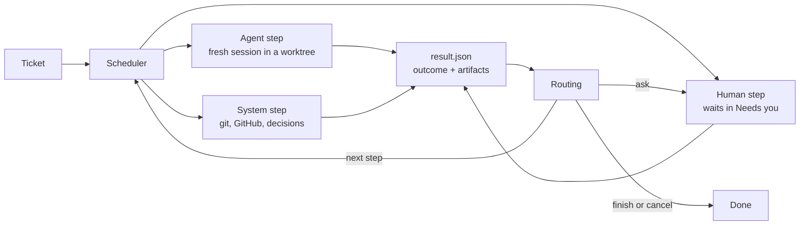

# Architecture

## Concepts

| Concept        | Meaning                                                                                                       |
| -------------- | ------------------------------------------------------------------------------------------------------------- |
| **Ticket**     | One unit of work. It targets one repository, may read others, and runs one workflow version.                  |
| **Workflow**   | A named, versioned list of steps with routes. Stored by content hash, so edits never change a running ticket. |
| **Step**       | An `agent`, `human` or `system` step. It reports one outcome when it finishes.                                |
| **Role**       | A fixed kind of agent with its own instructions, permissions and outcomes.                                    |
| **Action**     | A fixed kind of system work, configured with `with`.                                                          |
| **Capability** | Something a repository's kit provides, such as `setup` or `verify`. Steps declare what they need.             |
| **Kit**        | The `.kipster/` folder in a repository: how to set up, run, verify and merge it.                              |
| **Decision**   | A fast typed judgement (a choice with probabilities and a confidence) used where input is unstructured.       |

Roles: planner, builder, tester, reproducer, reviewer, writer, onboarder.
Actions: decide, verify-kit, maintain-pr, merge, split, wait-children.
The catalog in `src/domain/catalog.ts` is the single list of each.

## Principles the design enforces

- **One fresh agent session per step.** Steps share artifacts and the branch,
  never a conversation.
- **Typed outcomes drive routing.** Agents finish by reporting an outcome from
  their role's list; the engine never parses free text to decide where to go.
- **Agents propose, the system acts.** Only system actions push, open pull
  requests or merge.
- **Nothing judges its own work.** The tester never wrote the change, and its
  edits are discarded.
- **Every loop is bounded.** A step with a `limit` stops sending the ticket
  back once it reaches the limit.
- **A verdict belongs to one commit.** New commits or a moved base branch void
  it.
- **Hard rules before AI decisions.** Paths that always need a human are
  checked first; a decision only chooses within what the rules allow, and an
  unsure decision goes to a human.

## Modules

```
src/
  domain/       Pure rules: catalog, workflow parsing and validation, routing,
                the ticket lifecycle and the records the API returns.
                No I/O; the web app imports its types.
  library/      Loads and versions workflow files.
  store/        PostgreSQL access and append-only migrations. The only place
                that writes SQL; the engine and API call its functions.
  api/          HTTP API (Hono) and the response contract shared with the web app.
  engine/       Scheduler, context packets, step execution and system actions.
  executors/    Fresh Codex/Claude CLI sessions and process-group supervision.
  kit/          Zod kit validation and committed default-branch capability discovery.
  verification/ Disposable exact-commit instances, ports, databases and retained logs.
  artifacts/    Content-based media detection for evidence.
  workspace/    Repository caches, ticket worktrees and ownership-aware cleanup.
  github/       Small gh-backed PR interface.
  roles/        Base instructions for each catalog role.
  server.ts     Composes the store, library, engine and API into a running factory.
  cli.ts        `kf serve | migrate | check`.
  config.ts     Factory home and config.json.
web/            React app: what needs you, workflows, and later tickets.
workflows/      Built-in workflow library.
scripts/        Development and test PostgreSQL clusters.
tests/          Unit and integration tests (node:test) and browser tests (Playwright).
```

Later slices extend these modules with CI/checks and add `decider/` (typed decisions). They are part of the factory,
not plugins.

## Data flow



## Ticket lifecycle

A ticket runs one step at a time as a series of **attempts**; the database
allows at most one open (pending, running or waiting) attempt per ticket.
`src/domain/lifecycle.ts` decides every move and `src/store/tickets.ts` applies
it, with its artifacts and events, in one transaction.

- Agent and system steps start as `pending`. A scheduler claims them, marks
  them `running`, then completes them with a `StepResult` or fails them.
- Human steps start as `waiting` for you: approved, changes-needed (with a
  comment) or rejected.
- An outcome routed to `ask`, a failed attempt, or a second interruption in a
  row opens a `waiting` ask at that step. You retry it, move to any step, or
  cancel, optionally with a note.
- A merge step can wait for its pull request to be merged, then complete.
- Limits count finished runs of a step; interrupted attempts and asks do not
  count. An interrupted attempt is retried once automatically.
- The ticket's status comes from its latest attempt: queued, running,
  needs-you, done or cancelled.

Every write appends events. `GET /api/events` streams them with Server-Sent
Events, and a client that reconnects with Last-Event-ID misses nothing.

## Repositories on disk

A repository is cloned once into the factory home and kept: setup, caches and
secrets persist. Each ticket gets its own worktree and branch for its lifetime.
Each verification gets a disposable checkout of the exact commit, its own
empty PostgreSQL database (when requested) and ports, and is thrown away afterwards; only the evidence is
kept. Other repositories a ticket reads are cached read-only.

## Step engine (Slice 1)

`server.ts` starts `engine/scheduler.ts` alongside the HTTP API. Before any
recovery or claiming, the scheduler acquires a **session-level PostgreSQL
advisory lock** through `store/scheduler.ts`, on a dedicated connection held
until work stops. A second factory on the same database refuses to start.
Losing that connection stops claiming and aborts active processes; restart the
factory to recover. Only `store/` contains SQL. No API response shapes changed.

Startup calls `interruptRunning`: abandoned claims are released, and running
attempts follow the lifecycle's retry-once interruption rule. The scheduler
claims up to `concurrency` attempts across tickets, wakes on the events NOTIFY,
and polls every 15 seconds as a fallback. Merge-waiting attempts consume no
executor slot; their PR states are checked about once a minute. Cancellation
notifications abort the running step independently of slow cloning or GitHub
requests. Shutdown stops claiming, terminates active process groups, waits for
exit and records interruptions before releasing the lock. A restart resumes
through the existing lifecycle, never through a saved agent conversation.

`executors/process.ts` launches commands through a small Node supervisor. Each
command has its own POSIX process group. A timeout, cancellation or shutdown
kills the entire group. IPC disconnect also kills it if the factory crashes
(including SIGKILL); descendants are terminated when the leader exits. If a group kill reports `EPERM`, the supervisor checks the OS process table:
only a group with no live members counts as already stopped. A permission
failure with live members still fails the attempt. The supervisor is not a sandbox. Agents use the owner's CLI logins, environment,
configuration and unrestricted tools on the Mac. Role instructions reserve
pushes and GitHub mutations for system steps.

### Configuration

`kf serve --home <directory>` chooses the factory home (default
`~/.kipster-factory`) containing `config.json`:

```json
{
  "databaseUrl": "postgresql://localhost/kipster",
  "port": 4600,
  "concurrency": 2,
  "stepTimeoutMinutes": 60,
  "agents": {
    "default": { "cli": "codex" },
    "roles": {
      "planner": { "cli": "claude", "model": "sonnet" },
      "builder": { "cli": "codex" }
    }
  }
}
```

`concurrency` is a positive integer; `stepTimeoutMinutes` is positive and covers
workspace preparation and both result-file tries within the same attempt.
Omitted agent settings use Codex. A role entry replaces the default selection;
its optional `model` is passed to that CLI. Accepted CLI names are `codex` and
`claude`; accepted role keys come from the catalog. `allowedOrigins` retains its
existing meaning. The existing `--database-url` shortcut runs with defaults
instead of reading `config.json`.

Verified against installed Codex **0.160.0** and Claude Code **2.1.289**:

- Codex: `codex exec --dangerously-bypass-approvals-and-sandbox --ephemeral --json -`
- Claude: `claude --print --dangerously-skip-permissions --no-session-persistence --output-format stream-json --verbose`
- Both accept an optional `--model <model>`; prompts go through stdin. Neither
  command resumes a session or restricts tools. Stdout and stderr stream to an
  on-disk log recorded as an artifact before launching, including failed runs.

`kf serve --no-scheduler` and `npm run dev -- --no-scheduler` serve the UI/API
without executing tickets. Demo seeding holds the scheduler's advisory lock,
requires an empty database and permanently marks it as demo before inserting
fixtures. A scheduler refuses that database before recovery or cloning. Migration
003 also recognizes existing demo-shop data. Development uses `.local/factory`
by default so its database and workspace IDs stay together across checkouts.

### Workspaces and evidence

`workspace/` serializes Git operations per repository. Registered pending
repositories are cloned and marked ready or failed through the store. The cache's
`origin/HEAD` supplies the default branch; attempts also repair old registrations
that assumed `main`. The cache
is kept at `repositories/<repository-id>/repo`; ticket worktrees live at
`worktrees/<ticket-id>/repo`, on the ticket's `kipster/<number>-<slug>` branch.
Before creating a ticket worktree, the cache fetches origin and branches from
`origin/<defaultBranch>`. Later steps and restarts reuse that worktree and branch.
An ownership record ties each path to its repository/ticket; pre-existing paths
without a matching record are never adopted.

Only terminal (`done` or `cancelled`) tickets are eligible for removal, after
their executor has exited. Cleanup uses `git worktree remove` without force and
keeps branch references. Dirty, untracked or locked worktrees are retained for inspection. Cleanup removes
only ignored directories named `node_modules`, `dist`, `build`, `coverage`,
`playwright-report` or `test-results`, after checking ownership, branch, locks,
tracked content and symlinks. All other ignored files retain the worktree.
The database records successful removal (or an already absent worktree), so
subsequent passes and restarts skip it. The cache and `steps/` evidence are retained. This slice does not synchronize branches with a moving base or run CI. Kit
capabilities are refreshed from committed default-branch blobs after each cache
fetch; workflows needing missing capabilities remain gated by the store.

### Prompt and result contract

`engine/prompt.ts` combines `roles/<role>.md`, step `instructions`, an optional
repository `.kipster/roles/<role>.md`, and a context packet. The packet includes
the title/body, latest plan before human approval (labelled unapproved until
approval), prior step summaries and findings with attempt IDs, human comments
and notes, branch and diff statistics. Each role runs in a new CLI session.
Planners supply acceptance scenarios and never commit; builders implement and
commit; reviewers read the diff once, block only serious problems and leave
minor notes in the summary. Writers provide PR prose as note artifacts.
Non-authoring roles that change the worktree fail for human inspection; their
changes are preserved rather than silently published.

The factory writes the prompt to
`steps/<ticket-id>/<attempt-id>/<try>/prompt.md`, outside the repository, and
instructs the agent to write `result.json` beside it:

```json
{
  "outcome": "done",
  "summary": "Implemented and verified the approved change.",
  "artifacts": [
    {
      "kind": "evidence",
      "title": "Verification",
      "content": "Commands and observed results…"
    }
  ]
}
```

All three keys are required. Outcomes must belong to the role's catalog contract
or be `needs-decision`. Summary is nonempty. Artifacts use the existing lifecycle
schema: kind (`plan`, `comment`, `finding`, `evidence`, `log`, `note`), title, and
exactly one of Markdown `content` or a `path` to an existing file under the
factory home. Symlink escapes are rejected. File artifacts are copied into the
step directory before completion so worktree cleanup cannot erase evidence.
A successful planner must include a plan artifact. Missing or invalid results
get one fresh CLI retry in a separate directory; a second invalid result fails
the attempt and opens a human ask. Timeouts fail immediately. Chat text is never
parsed for routing. Logs survive failures and cancellation.

### System actions and verification

`maintain-pr` requires a commit ahead of the base; otherwise it reports
`needs-decision`. It pushes the ticket branch, then calls the small `github/`
interface backed by `gh`. It looks up the repository's existing PR for the branch
(including closed and merged PRs), updates an open PR's title/body or creates one
if none exists. The title is the ticket title; the body combines the ticket, approved plan,
latest finished step summaries, successful verification evidence and writer
notes. Superseded plans, prior review rounds and operational human notes stay
in the ticket timeline. The URL is persisted before reporting
`ready`, making retry after a partial publication idempotent. `merge` parks the
attempt as `pull-request-merge`; polling reports `merged` or `rejected` when the
owner merges or closes it. The factory never invokes `gh pr merge`. Other system
actions explicitly fail to a human in this slice.

`tests/engine.test.ts` uses a scripted executable, real PostgreSQL and local bare
Git repositories, with GitHub calls substituted behind the interface. It covers
the quick-change approval/review loop, merge waiting, failure/retry, process-group
timeout/cancellation, crash recovery, lock exclusion, concurrency and ownership.
`node scripts/live-engine-check.ts [source-repository]` is an explicit opt-in
smoke check using the real default CLI: it clones the source into a temporary
home, removes its remote, runs planner and builder, validates both results and
checks the local commit. It retains evidence and never pushes. Real GitHub
publication/merge and Claude execution are not exercised by that smoke check.

## Proof foundation (Slice 2A)

The complete kit, harness and consumer contract is in [docs/kit.md](kit.md).
`.kipster/kit.yml` declares version 1, optional setup, deterministic check, and an
optional verify block (start, ready, ports, database, timeoutSeconds). Verification
README and structured feature maps are validated alongside the block. Optional
roles/<role>.md prompt additions continue unchanged. The onboarder receives the
kit guide in its prompt. The cache fetch refreshes the default branch, kit status
and capabilities together; an invalid kit clears capabilities with a diagnostic.

`verification/startVerification` (implemented in `verification/harness.ts`) creates
an isolated detached clone of the exact commit inside factory home, runs setup,
optionally check, reserves ports, creates a fresh database on the factory's own
PostgreSQL server when requested, starts a supervised process group and polls a
local readiness URL for 2xx. Agents never own instance startup or shutdown.
Callers receive URL, ports, nullable databaseUrl, checkout, retained evidenceDir,
log artifact inputs, an exited promise and an idempotent stop(). Stop terminates
that group, drops its generated database and removes the disposable clone.
Failures name their stage and retain available logs; SIGKILL process cleanup is
supervised but orphaned database/checkout recovery is deferred.

`verify-kit` runs the ticket HEAD's candidate kit with check enabled, stops it,
and reports passed/failed with logs and a stage finding on failure. It cannot
change default-branch capabilities. Onboarding is write-kit → verify-kit →
approve-kit → maintain-pr → merge, with failed verification routed back to
write-kit up to three runs. Human approval remains required. Feature-map semantic
proof belongs to the independent tester; boot readiness alone does not prove it.

Migration 004 adds `Artifact.mediaType`, `Attempt.headCommit`, and repository kit
status/error (capabilities reuse the existing column). The API adds
`Repository.kit: {status, error, capabilities}` and retains the old capabilities
alias. File signatures detect image/video types; text is inert Markdown/plain
text/JSON, unknown binary is application/octet-stream. The artifact endpoint
uses the detected content type with the existing path containment, nosniff and
sandbox CSP. Ticket responses resolve legacy file media types too. Inline
artifacts are text/markdown. Attempt commits are supplied by the factory at
completion, independently of agent JSON; legacy/unobserved commits remain null.
Consumers must compare verdict commits to the current branch, never infer
freshness from a summary or a null commit. Live ref checking/retest routing is
reserved for Slice 3.

`seed:demo` generates synthetic image, WebM and log files inside the selected
home, and includes valid/invalid kits plus passed/current and stale feature
verdicts without running an engine. `npm run dev` keeps the factory alive during
source edits; explicit restart loads changes. `npm run dev -- --watch` opts into
restarts. Web hot reload remains enabled in either mode.
