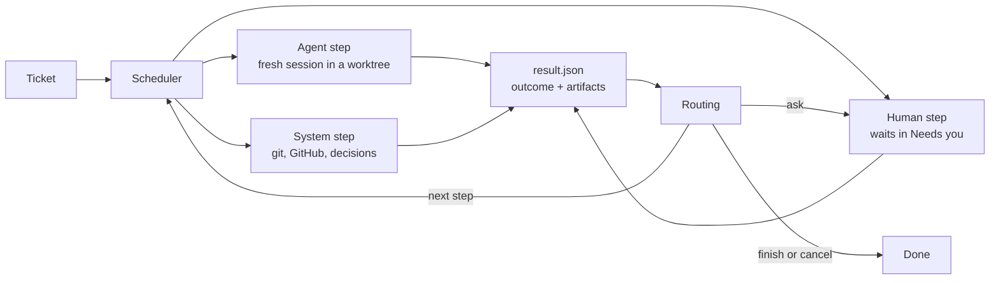

# Architecture

## Concepts

| Concept        | Meaning                                                                                                       |
| -------------- | ------------------------------------------------------------------------------------------------------------- |
| **Ticket**     | One unit of work. It targets one repository, may read others, and runs one workflow version.                  |
| **Workflow**   | A named, versioned list of steps with routes. Stored by content hash, so edits never change a running ticket. |
| **Step**       | An `agent`, `human` or `system` step. It reports one outcome when it finishes.                                |
| **Role**       | A fixed kind of agent with its own instructions, permissions and outcomes.                                    |
| **Action**     | A fixed kind of system work, configured with `with`.                                                          |
| **Capability** | Something a repository's kit provides, such as `setup` or `verify`. Steps declare what they need.             |
| **Kit**        | The `.kipster/` folder in a repository: how to set up, run, verify and merge it.                              |
| **Decision**   | A fast typed judgement (a choice with probabilities and a confidence) used where input is unstructured.       |

Roles: planner, builder, tester, reproducer, reviewer, writer, onboarder.
Actions: decide, verify-kit, maintain-pr, merge, split, wait-children.
The catalog in `src/domain/catalog.ts` is the single list of each.

## Principles the design enforces

- **One fresh agent session per step.** Steps share artifacts and the branch,
  never a conversation.
- **Typed outcomes drive routing.** Agents finish by reporting an outcome from
  their role's list; the engine never parses free text to decide where to go.
- **Agents propose, the system acts.** Only system actions push, open pull
  requests or merge.
- **Nothing judges its own work.** The tester never wrote the change, and its
  edits are discarded.
- **Every loop is bounded.** A step with a `limit` stops sending the ticket
  back once it reaches the limit.
- **A verdict belongs to one commit.** New commits or a moved base branch void
  it.
- **Every integration is optional.** The factory works without it. A missing
  TypeSafe key never fails a ticket: the decision goes to the owner.
- **Hard rules before AI decisions.** Paths that always need a human are
  checked first; a decision only chooses within what the rules allow, and an
  unsure decision goes to a human.

## Modules

```
src/
  domain/       Pure rules: catalog, workflow parsing and validation, routing,
                the ticket lifecycle and the records the API returns.
                No I/O; the web app imports its types.
  library/      Loads and versions workflow files.
  store/        PostgreSQL access and append-only migrations. The only place
                that writes SQL; the engine and API call its functions.
  api/          HTTP API (Hono) and the response contract shared with the web app.
  engine/       Scheduler, context packets, step execution and system actions.
  executors/    Fresh Codex/Claude CLI sessions and process-group supervision.
  kit/          Zod kit validation and committed default-branch capability discovery.
  verification/ Disposable exact-commit instances, ports, databases and retained logs.
  artifacts/    Content-based media detection for evidence.
  workspace/    Repository caches, ticket worktrees and ownership-aware cleanup.
  github/       Small gh-backed PR interface.
  roles/        Base instructions for each catalog role.
  server.ts     Composes the store, library, engine and API into a running factory.
  cli.ts        `kf setup | secret | serve | migrate | check`.
  config.ts     Factory home and config.json.
web/            React app: what needs you, workflows, and later tickets.
workflows/      Built-in workflow library.
scripts/        Development and test PostgreSQL clusters.
tests/          Unit and integration tests (node:test) and browser tests (Playwright).
```

Slice 3 extends the GitHub interface with CI/checks and feedback. Later slices
`decider/` provides typed decisions in Slice 4. These are part of the factory, not plugins.

## Data flow



## Ticket lifecycle

A ticket runs one step at a time as a series of **attempts**; the database
allows at most one open (pending, running or waiting) attempt per ticket.
`src/domain/lifecycle.ts` decides every move and `src/store/tickets.ts` applies
it, with its artifacts and events, in one transaction.

- Agent and system steps start as `pending`. A scheduler claims them, marks
  them `running`, then completes them with a `StepResult` or fails them.
- Human steps start as `waiting` for you: approved, changes-needed (with a
  comment) or rejected.
- An outcome routed to `ask`, a failed attempt, or a second interruption in a
  row opens a `waiting` ask at that step. You retry it, move to any step, or
  cancel, optionally with a note.
- CI and merge steps park while waiting for GitHub; neither holds an executor
  slot. CI completion resumes routing; merge also watches for owner feedback.
- Limits count finished runs of a step; interrupted attempts and asks do not
  count. An interrupted attempt is retried once automatically.
- The ticket's status comes from its latest attempt: queued, running,
  needs-you, done or cancelled.

Every write appends events. `GET /api/events` streams them with Server-Sent
Events, and a client that reconnects with Last-Event-ID misses nothing.

## Repositories on disk

A repository is cloned once into the factory home and kept: setup, caches and
secrets persist. Each ticket gets its own worktree and branch for its lifetime.
Each verification gets a disposable checkout of the exact commit, its own
empty PostgreSQL database (when requested) and ports, and is thrown away afterwards; only the evidence is
kept. Other repositories a ticket reads are cached read-only.

## Step engine (Slice 1)

`server.ts` starts `engine/scheduler.ts` alongside the HTTP API. Before any
recovery or claiming, the scheduler acquires a **session-level PostgreSQL
advisory lock** through `store/scheduler.ts`, on a dedicated connection held
until work stops. A second factory on the same database refuses to start.
Losing that connection stops claiming and aborts active processes; restart the
factory to recover. Only `store/` contains SQL. No API response shapes changed.

Startup calls `interruptRunning`: abandoned claims are released, and running
attempts follow the lifecycle's retry-once interruption rule. The scheduler
claims up to `concurrency` attempts across tickets, wakes on the events NOTIFY,
and polls every 15 seconds as a fallback. CI- and merge-waiting attempts consume no
executor slot; their GitHub states are checked about once a minute. Both waits
survive a restart. CI has an immediate first snapshot and a persisted timeout. Cancellation
notifications abort the running step independently of slow cloning or GitHub
requests. Shutdown stops claiming, terminates active process groups, waits for
exit and records interruptions before releasing the lock. A restart resumes
through the existing lifecycle, never through a saved agent conversation.

`executors/process.ts` launches commands through a small Node supervisor. Each
command has its own POSIX process group. A timeout, cancellation or shutdown
kills the entire group. IPC disconnect also kills it if the factory crashes
(including SIGKILL); descendants are terminated when the leader exits. If a group kill reports `EPERM`, the supervisor checks the OS process table:
only a group with no live members counts as already stopped. A permission
failure with live members still fails the attempt. The supervisor is not a sandbox. Agents use the owner's CLI logins, environment,
configuration and unrestricted tools on the Mac. Role instructions reserve
pushes and GitHub mutations for system steps.

### Configuration

`kf serve --home <directory>` chooses the factory home (default
`~/.kipster-factory`) containing `config.json`:

```json
{
  "databaseUrl": "postgresql://localhost/kipster",
  "port": 4600,
  "concurrency": 2,
  "stepTimeoutMinutes": 60,
  "agents": {
    "default": { "cli": "codex" },
    "roles": {
      "planner": { "cli": "claude", "model": "sonnet" },
      "builder": { "cli": "codex" }
    }
  }
}
```

`concurrency` is a positive integer; `stepTimeoutMinutes` is positive and covers
workspace preparation and both result-file tries within the same attempt.
Omitted agent settings use Codex. A role entry replaces the default selection;
its optional `model` is passed to that CLI. Accepted CLI names are `codex` and
`claude`; accepted role keys come from the catalog. `allowedOrigins` retains its
existing meaning. The existing `--database-url` shortcut runs with defaults
instead of reading `config.json`.

Verified against installed Codex **0.160.0** and Claude Code **2.1.289**:

- Codex: `codex exec --dangerously-bypass-approvals-and-sandbox --ephemeral --json -`
- Claude: `claude --print --dangerously-skip-permissions --no-session-persistence --output-format stream-json --verbose`
- Both accept an optional `--model <model>`; prompts go through stdin. Neither
  command resumes a session or restricts tools. Stdout and stderr stream to an
  on-disk log recorded as an artifact before launching, including failed runs.

`kf serve --no-scheduler` and `npm run dev -- --no-scheduler` serve the UI/API
without executing tickets. Demo seeding holds the scheduler's advisory lock,
requires an empty database and permanently marks it as demo before inserting
fixtures. A scheduler refuses that database before recovery or cloning. Migration
003 also recognizes existing demo-shop data. Development uses `.local/factory`
by default so its database and workspace IDs stay together across checkouts.

### Workspaces and evidence

`workspace/` serializes Git operations per repository. Registered pending
repositories are cloned and marked ready or failed through the store. The cache's
`origin/HEAD` supplies the default branch; attempts also repair old registrations
that assumed `main`. The cache
is kept at `repositories/<repository-id>/repo`; ticket worktrees live at
`worktrees/<ticket-id>/repo`, on the ticket's `kipster/<number>-<slug>` branch.
Before creating a ticket worktree, the cache fetches origin and branches from
`origin/<defaultBranch>`. Later steps and restarts reuse that worktree and branch.
An ownership record ties each path to its repository/ticket; pre-existing paths
without a matching record are never adopted.

Only terminal (`done` or `cancelled`) tickets are eligible for removal, after
their executor has exited. Cleanup uses `git worktree remove` without force and
keeps branch references. Dirty, untracked or locked worktrees are retained for inspection. Cleanup removes
only ignored directories named `node_modules`, `dist`, `build`, `coverage`,
`playwright-report` or `test-results`, after checking ownership, branch, locks,
tracked content and symlinks. All other ignored files retain the worktree.
The database records successful removal (or an already absent worktree), so
subsequent passes and restarts skip it. The cache and step metadata are retained; recorded files are owned by the per-ticket evidence store. `maintain-pr` synchronizes branches
with the fetched base and watches CI (Slice 3). Kit
capabilities are refreshed from committed default-branch blobs after each cache
fetch; workflows needing missing capabilities remain gated by the store.

### Prompt and result contract

`engine/prompt.ts` combines `roles/<role>.md`, step `instructions`, an optional
repository `.kipster/roles/<role>.md`, and a context packet. The packet includes
the title/body, latest plan before human approval (labelled unapproved until
approval), prior step summaries and findings with attempt IDs, human comments
and notes, branch and diff statistics. Each role runs in a new CLI session.
Planners supply acceptance scenarios and never commit; builders implement and
commit; reviewers read the diff once, block only serious problems and leave
minor notes in the summary. Writers provide PR prose as note artifacts.
Planner, reviewer and writer changes to the ticket worktree fail for human
inspection and are preserved. Tester and reproducer sessions instead use
disposable checkouts, as described in Independent proof below.

The factory writes the prompt to
`steps/<ticket-id>/<attempt-id>/<try>/prompt.md`, outside the repository, and
instructs the agent to write `result.json` beside it:

```json
{
  "outcome": "done",
  "summary": "Implemented and verified the approved change.",
  "artifacts": [
    {
      "kind": "evidence",
      "title": "Verification",
      "content": "Commands and observed results…"
    }
  ]
}
```

All three keys are required; a passed reviewer may also supply the typed
`ownerReview` field described below. Outcomes must belong to the role's catalog contract
or be `needs-decision`. Summary is nonempty. Artifacts use the existing lifecycle
schema: kind (`plan`, `comment`, `finding`, `evidence`, `log`, `note`), title, and
exactly one of Markdown `content` or a `path` to an existing file under the
factory home. Symlink escapes are rejected. File artifacts are copied into `evidence/<ticket-id>/` before recording, so scratch and worktree cleanup cannot erase evidence.
A successful planner must include a plan artifact. Missing or invalid results
get one fresh CLI retry in a separate directory; a second invalid result fails
the attempt and opens a human ask. Timeouts fail immediately. Chat text is never
parsed for routing. Logs survive failures and cancellation.

### System actions and verification

`maintain-pr` requires a clean worktree. Workspace preparation fetches origin;
the action pins and merges `origin/<defaultBranch>` into the ticket branch.
It never rebases or force-pushes. A conflict is aborted and reports `conflict`
with a finding listing the files for the builder. After a clean merge, a prior
tester execution must be a passing verdict for the exact resulting HEAD;
otherwise `base-moved` routes back to testing. This check also catches a restart
after the merge committed but before its outcome was recorded. Workflows without
a tester can still publish. A branch with no commits ahead asks the owner.

Before publishing a new head, `engine/pr-writer.ts` runs the writer in a fresh
session using the writer's configured CLI and kit instructions. Its one inline
note explains the change and why, describes current-commit scenario evidence in the factory,
optionally includes a small Mermaid diagram, identifies `Verified at <sha>`, and
states `Merge danger:` with a one-way/two-way door and blast radius. Output is
limited to 4,000 characters and names the factory ticket; it contains no local evidence links. CI is still pending at this point; the prose describes its status at
writing and directs readers to current checks rather than making a lasting status claim.
The factory caches the description by ticket and head, records the note and run
log, and rejects writer worktree edits. Invalid output gets one fresh retry.
Full plans, logs and prior review rounds remain in the factory timeline.

The action pushes normally, creates or updates the branch PR through `gh`, and
persists its URL. Existing closed/merged PRs are reused. It parks as
`pull-request-checks`, recording the pushed commit and waiting timestamp, and
immediately takes one check snapshot. Pending checks are subsequently polled
without an executor slot. The GitHub adapter queries the exact SHA via `gh api`,
paginates checks, and checks branch protection/rulesets for required checks not
yet reported. Required checks must pass (GitHub also accepts neutral/skipped
runs). Without required checks, all reported checks are considered; no checks waits for `ciSettleMinutes` (default 3) after the push before treating the repository as having no CI. A changed local/remote head asks the owner rather than
accepting another commit's green CI. Failed checks report `ci-failed` with names,
links and at most 2,000 characters of log per check. Actions logs come from
`gh run view --job --log-failed`; other providers use their supplied summary/text,
and unavailable logs are explicitly labelled. API errors leave the wait intact;
the deadline still applies.

CI and owner-merge waits also fetch the default branch. If it contains commits
missing from the ticket, the lifecycle closes the obsolete wait and queues a
fresh attempt of the most recent `maintain-pr` step. This works with the ticket's
saved workflow version. Polling itself neither merges nor starts a writer;
normal scheduler capacity controls that work. Maintenance merges the base and
requires a fresh tester verdict for the resulting commit before republishing.
Standalone merge workflows without prior maintenance retain their existing
behavior, and new review feedback still goes to the builder first.

Configure `maintain-pr` through `with`, for example:

```yaml
with:
  ciTimeoutMinutes: 60
  ciSettleMinutes: 3
  maxBaseSyncs: 3
```

The timeout defaults to 60 minutes and reports `needs-decision` to the owner.
Evidence stays on the ticket until hosted attachments are configured in a later slice. The `factoryUrl` parameter has been removed. Migration 005 adds
the CI waiting value and the description cache. No step fields are added.

`merge` parks as `pull-request-merge`. Polling reports `merged` or `rejected`
when the factory or owner merges it, or the owner closes it. For an open PR it also reads paginated reviews,
issue comments and inline review comments via `gh`. A current change-requesting
review from a human, or a new owner comment, reports `changes-needed`; feedback
becomes comment artifacts with source links for the builder. The owner is the
repository owner, a commenter with OWNER association, or the authenticated factory
operator (including organization repositories). Bots and factory-marked content
(`<!-- kipster-factory -->`) are ignored; author identity alone cannot distinguish
a human from the factory using the same CLI login. Comment artifacts carry source
IDs so retries/restarts and later merge waits do not replay consumed feedback.
Superseded/dismissed change requests are ignored. Only the system merge policy described below may invoke `gh pr merge`. Other system actions explicitly fail to a human in this slice.

`tests/pull-requests.test.ts` uses real PostgreSQL, local bare remotes, a fake
writer and a stub GitHub interface to cover clean/conflicting merges, stale
verdicts, CI outcomes/timeouts, restart and executor-slot release, writer caching
and feedback deduplication. `tests/github.test.ts` checks pagination, required
checks, bounded log excerpts and feedback filtering. These do not prove live
GitHub publication, CI propagation timing, provider permissions or feedback
round trips by themselves. The live factory-floor acceptance run additionally
exercised onboarding, real feature and base/head bug evidence, required CI waits,
writer publication, owner feedback and merges, and base movement with fresh proof.
See the [roadmap](roadmap.md) for the acceptance scope and remaining limits.

`tests/engine.test.ts` uses a scripted executable, real PostgreSQL and local bare
Git repositories, with GitHub calls substituted behind the interface. It covers
the quick-change approval/review loop, merge waiting, failure/retry, process-group
timeout/cancellation, crash recovery, lock exclusion, concurrency and ownership.
`node scripts/live-engine-check.ts [source-repository]` is an explicit opt-in
smoke check using the real default CLI: it clones the source into a temporary
home, removes its remote, runs planner and builder, validates both results and
checks the local commit. It retains evidence and never pushes. Real GitHub
publication/merge and Claude execution are not exercised by that smoke check.

## Proof foundation (Slice 2A)

The complete kit, harness and consumer contract is in [docs/kit.md](kit.md).
`.kipster/kit.yml` declares version 1, optional setup, deterministic check, and an
optional verify block (start, ready, ports, database, timeoutSeconds). Verification
README and structured feature maps are validated alongside the block. Optional
roles/<role>.md prompt additions continue unchanged. The onboarder receives the
kit guide in its prompt. The cache fetch refreshes the default branch, kit status
and capabilities together; an invalid kit clears capabilities with a diagnostic.

`verification/startVerification` (implemented in `verification/harness.ts`) creates
an isolated detached clone of the exact commit inside factory home, runs setup,
optionally check, reserves ports, creates a fresh database on the factory's own
PostgreSQL server when requested, starts a supervised process group and polls a
local readiness URL for 2xx. Agents never own instance startup or shutdown.
Callers receive URL, ports, nullable databaseUrl, checkout, retained evidenceDir,
log artifact inputs, an exited promise and an idempotent stop(). Stop terminates
that group, drops its generated database and removes the disposable clone.
Failures name their stage and retain available logs; SIGKILL process cleanup is
supervised but orphaned database/checkout recovery is deferred.

`verify-kit` runs the ticket HEAD's candidate kit with check enabled, stops it,
and reports passed/failed with logs and a stage finding on failure. It cannot
change default-branch capabilities. Onboarding is write-kit → verify-kit →
approve-kit → maintain-pr → merge, with failed verification routed back to
write-kit up to three runs. Human approval remains required. Feature-map semantic
proof belongs to the independent tester; boot readiness alone does not prove it.

Migration 004 adds `Artifact.mediaType`, `Attempt.headCommit`, and repository kit
status/error (capabilities reuse the existing column). The API adds
`Repository.kit: {status, error, capabilities}` and retains the old capabilities
alias. File signatures detect image/video types; text is inert Markdown/plain
text/JSON, unknown binary is application/octet-stream. The artifact endpoint
uses the detected content type with the existing path containment, nosniff and
sandbox CSP. Ticket responses resolve legacy file media types too. Inline
artifacts are text/markdown. Attempt commits are supplied by the factory at
completion, independently of agent JSON; legacy/unobserved commits remain null.
Consumers must compare verdict commits to the current branch, never infer
freshness from a summary or a null commit. Slice 3 checks verdict freshness against the synchronized branch HEAD before
publication and routes stale verdicts back to testing.

`seed:demo` generates synthetic image, WebM and log files inside the selected
home, and includes valid/invalid kits plus passed/current and stale feature
verdicts without running an engine. `npm run dev` keeps the factory alive during
source edits; explicit restart loads changes. `npm run dev -- --watch` opts into
restarts. Web hot reload remains enabled in either mode.

## Independent proof (Slice 2B)

Tester and reproducer steps use `engine/proof.ts`, separate from ordinary agent
execution. The factory resolves immutable object IDs after fetching the base,
loads the trusted base commit's kit, README, feature maps and role additions,
and starts the harness before invoking a fresh agent session. A tester runs in
a disposable detached checkout of the ticket HEAD; a reproducer runs on the
base branch HEAD. Neither uses the builder's worktree. Local edits and even
accidental local commits disappear with the disposable clone, which has no
remote; nothing copies them back to the ticket branch. This is isolation from
the normal publication path, not an OS sandbox for an unrestricted agent.

The prompt includes the exact commit, instance URL, database URL, evidence
directory, verification documents and the approved plan's acceptance scenarios.
All maps are supplied so a relevant entry point cannot be lost to heuristic
selection. The agent drives the actual user surface first; state inspection may
only corroborate that run. Skipped entry points, wrong surfaces, stale builds,
inconclusive results and self-reports cannot pass. The factory validates
nonempty evidence files in the current instance's evidence directory, excluding
startup logs. A `changes-needed` result requires findings naming Scenario,
Observed, Expected and an attached Evidence filename. These checks enforce the
shape and provenance of evidence; judging whether it proves the scenario remains
the independent agent's job.

A reproducer returns `reproduced` or `not-reproduced`, with a `Reproduction steps`
note containing exact actions, inputs, observations and evidence. The note is
passed to later steps. `not-reproduced` follows the existing unrouted-outcome
rule and asks the owner without starting a fix. A tester in a workflow containing
a reproducer requires a successful reproduction, then starts **two** isolated
instances: the freshly fetched base and the ticket HEAD. It repeats the same
reproduction against both, requiring the failure on base and success on head,
with separate evidence files and databases. If the base was independently fixed,
the comparison cannot pass.

The agent is raced against both instance lifetimes. Unexpected app exits abort
the agent; success, execution failure, invalid results, timeout and cancellation
all await agent termination and every instance's `stop()` in `finally`. Cleanup
failures fail the attempt rather than report a pass. A malformed/evidence-free
result gets one fresh session with fresh instances, never a contaminated retry.
Evidence and process logs survive checkout removal, including failed/cancelled
runs. Valid result files, including reproduction notes, are copied into the per-ticket evidence store before scratch directories are removed.

`Attempt.headCommit` is pinned by the factory **before** proof execution: the
base SHA for reproduction, the tested ticket SHA for a tester. Disposable agent
commits cannot change that observation. A concurrent ticket HEAD change rejects
the verdict. Successful tester summaries include `Verified at <full sha>` (and
the base/head pair for bugs), which the existing PR description formatter carries
through. `store/verdicts.ts:isLatestTesterVerdictCurrent(database, ticketId, sha)`
returns true only when the latest tester execution, identified by role in the
ticket's immutable workflow, finished with `passed` at exactly that SHA. Null,
missing, pending, failed, interrupted and superseded verdicts cannot count. The
caller must supply the live branch commit; base synchronization and routing back
to test remain the PR-maintenance consumer's responsibility.

`tests/proof.test.ts` runs the harness fixture HTTP application with real
PostgreSQL and a fake agent that actually calls its checkout endpoint and saves
responses. It covers the feature correction loop, bug comparison, owner asks,
trusted instructions, discarded edits, stale verdicts and cleanup.
`node scripts/with-test-database.ts node scripts/live-proof-check.ts` is the
explicit opt-in check with the real default CLI. It runs independent reproducer
and tester sessions against the HTTP fixture, with a deterministic fixture fix
between them, retains local evidence, and never publishes a branch. It does not
verify browser UI proof, Claude, GitHub publication or moving-base routing.

## Guided setup and secrets (Slice 4)

`kf setup` creates or updates the home's config.json, keeping fields it does not
ask about. It validates the PostgreSQL connection and migrates it before saving,
asks for a port, and warns about missing Git, gh/auth, Codex and Claude. Scripted
setup uses `--non-interactive`, `--database-url`, `--port`, `--skip-typesafe` or
`--typesafe-stdin`. TypeSafe is an optional, hidden-input step validated through
GET /v1/models. Re-running with Enter retains an existing stored key.

`kf secret set|list|remove` manages named secrets. The pinned @napi-rs/keyring
backend uses service `kipster-software-factory` and the secret name as account;
Linux explicitly selects Secret Service. Unavailable OS storage falls back to
home/secrets.json, written atomically with mode 0600 and a warning. Tests select
`--secret-backend file` and never access OS credentials. macOS is tested; Linux
remains unverified and Windows validation is later. Settings and secrets do not
use .env files or environment variables. A secret is read at the moment of use,
passed explicitly only to its client, and never added to executor environments,
prompts, events, artifacts, logs or API responses. SDK logging is disabled, and
remote error bodies are replaced with safe status/category messages.
Agents run unsandboxed under the same user, so the file fallback (like
config.json) is readable by them; prefer the OS store. Engine key reads stop
waiting after 10 seconds, so a blocked credential prompt sends the decision to
the owner instead of holding an executor slot.

## Typed decisions (Slice 4)

The system `decide` action asks one SDK Choice question using its catalog `with`
parameters. `engine/decision-facts.ts` is the single state builder: ticket title
and body, fetched origin/default base and ticket HEAD, changed paths with added
and removed line counts (null for binary files), latest tester/reproducer/reviewer
verdicts with status and commit, and exact-head CI state when available. Agent
summaries and artifacts are excluded. Unknown CI stays null. This is descriptive
input, not a merge gate; Wave 2 must enforce hard rules before using decisions.

`domain/decisions.ts` applies inclusive confidence bands (defaults act 0.9,
confirm 0.6). High confidence routes the selected option; medium confidence parks
as `decision` for one-click acceptance or another option; low confidence asks the
owner, displaying probabilities as information only. Missing keys or exhausted
SDK errors use the same owner controls, never fail a ticket. Cancellation and
shutdown signals still stop execution normally. The pinned SDK always receives
an explicit key, base URL, logging setting and `jev-1.13.0`; the log retains the
model version actually returned. SDK retries default to two after the initial
request, with a 10-second timeout per attempt and cancellable backoff.

Migration 006 adds a decision log, one row per attempt. Its JSON input preserves
question, options, thresholds, facts, model response, usage, band, safe fallback
reason and elapsed request time; final choice, decider, override and timestamps
are recorded separately. Logging and routing/parking share a ticket-locked
transaction. An owner answer closes the original system attempt, uses the same
pure option routing and limits as the model, and cannot answer a stale attempt.
Parked decisions survive restart. Cancelled pending decisions stay in the log
but do not appear as needing an answer. Ticket responses add `decisions`; the
option endpoint is separate from the existing human approval endpoint. The
Decisions page lists the latest 100 outcomes with all-time counts grouped by
workflow version and step so different threshold configurations are not mixed.

## Merge gate (Slice 4, Wave 1)

`domain/merge-gate.ts` evaluates facts without I/O. Readiness requires a passing
latest independent tester at the PR head when the workflow has a tester, the current reproduction comparison
for bug workflows, no base commits missing from that head, green required CI (or
explicitly no checks), no unconsumed owner feedback or current change request,
no queued/running work, and an open, non-draft, conflict-free PR. Unknown facts
and failed observations block. Untested workflows have a needs-owner reason, without a readiness blocker. Hard
path rules are separate from readiness: the kit, CI and migrations always need
human review. Custom migration globs only add rules and are loaded from the
fetched default-branch kit. Rename/deletion paths are included. Missing kits use
defaults; invalid trusted kits block.

Existing CI/merge polling stores the latest evaluation and last ready head in
`merge_gates`, without an executor slot. The API adds `mergeGate`; it overlays
new queued/running work and later commit observations to prevent cached green
facts from hiding a rebuild. GitHub errors invalidate readiness while terminal
PR detection can still finish a ticket. The UI separates per-check CI facts from
the writer's historical description. A previous green head remains visible.
Readiness is one input to the opt-in automatic merge policy below.

A reproducer's original verdict remains at its base commit. A successful bug
tester records `reproductionAttemptId` identifying the reproduction it repeated
on both current base and ticket head. The gate uses that comparison's tester
commit as the reproduction's confirmed head, never relabels the original base
verdict, and rejects a different/newer reproduction or tester. Independent proof,
repository checks and approved unverified scenarios remain distinct facts. This
slice has no structured approval data; the UI and writer say it is unavailable.

## Automatic merges and post-merge checks (Slice 4, Wave 2)

Repositories store `autoMerge` in PostgreSQL, off by default. The Repositories
page updates it through `POST /api/repositories/:id/auto-merge`; no config file or
environment variable enables it. With the setting off, the owner merges through
GitHub as before. There is no model or TypeSafe call on the merge path; `decide`
and its decision log remain available for workflow judgements.

The system merges only when the fresh gate is ready with no needs-owner reasons
and the latest independent tester and reviewer verdicts both passed at the exact
PR head. Workflows without a tester or reviewer need the owner (`Untested
workflow` / `Unreviewed workflow`). Kit, CI and migration paths and invalid
trusted kits always prevent a factory merge.

A reviewer can pass with `ownerReview: { reason: "…" }` in its result. The field
is validated, accepted only for a passed reviewer verdict, and stored on that
attempt. At that head the gate shows the reason as a needs-owner condition.
Prose never sets the flag. Reviewers use it for correct changes involving auth,
permissions, data deletion/rewrites, public contracts, sensitive security code or
weakened tests. A flagged pass still proceeds through publication normally. Bug
workflows now review after testing, with changes-needed routed to the fixer and
limit 2.

Immediately before acting, the system fetches and evaluates fresh Git, store
and GitHub facts; a stored green gate is never authorization. The head must
still match, and `gh pr merge --squash --match-head-commit` enforces it at GitHub.
`merge_requests` records the authorized head and gate before the call. Transient
errors remain retryable with fresh facts. If GitHub reports that requested head
merged after a crash or lost response, the factory reconciles the request,
clears the error and records a factory merge. The timeline records the rule
authorization, factory/owner actor and merge commit.

`post_merge_checks` owns one job per repository/merge commit, including owner
merges. Bounded background jobs inspect all reported GitHub checks on the exact
merge commit, independently of PR-only requirements, without occupying executor
slots or holding the scheduler loop. They allow three
minutes for check registration. If PR CI existed but no default-branch checks
appear, they wait up to an hour, then use the kit's deterministic check. A
repository with no CI uses the merged kit's setup/check in the verification
harness's disposable exact-commit checkout, without starting an app. Missing or
invalid kits are recorded as unavailable. GitHub API errors remain retryable;
kit infrastructure failures are persisted and bounded to three attempts, then
recorded as unavailable with the reason. Setup/check failures open a bug. Failing checks open one `bug` ticket in the same repository with check
excerpts, PR and merge commit, and add a linked note to the original timeline.
Bug creation and job completion share a transaction, preventing duplicate bugs
across retries or restarts. The job table has no general ticket-link semantics.

`maintain-pr` counts consecutive base re-syncs. `maxBaseSyncs` defaults to 3;
when the base moves again at the bound, the ticket parks for the owner before
another merge or re-test. Only re-syncs queued from a base-moved PR wait count;
initial publication and maintenance after feedback rebuilds do not. Starting
builder or tester work breaks the streak. A merged PR or an owner retry/move
also resets the count.

## Durable evidence (Slice 4, Wave 1)

Recorded file artifacts are copied to `home/evidence/<ticket-id>/<unique-file>`
before the ticket-locking transaction opens. Newly copied, unreferenced files are removed if preparation or the transaction fails; existing owned live logs are preserved. If a commit acknowledgement is lost, referenced evidence survives; uncertain copies are preserved when the database cannot confirm their state. Sources and destinations are contained in home
with symlink resolution. Engine/harness logs are written directly to their owned
stable files so live logs remain live. Proof records each file's actual base/head
`observedCommit` separately from the attempt verdict; agents cannot provide this
field. After process shutdown and successful retention, proof scratch directories
are removed. Legacy completed files are adopted in bounded background batches;
original legacy files are preserved when their ownership is uncertain.

Result artifacts add optional `scenario` and `scenarioResult` labels. The pure
scenario index chooses one key screenshot, recording or text item per independent
role/scenario from the latest attempt, preferring the requested head. Unlabelled
files remain in the archive. The API adds `evidenceIndex`; stable same-origin
routes `#/tickets/<number>/evidence/<artifact-id>` open items. Older attempts,
additional media and logs are behind the archive. No installation URL or Tailscale
integration is required. PR descriptions state `Verified at <sha>`, scenario
observations and `Evidence on ticket #<n> in the factory`, with no local links.

`config.json` adds `evidenceRetentionDays` (positive integer, default 30).
An hourly bounded scheduler background task prunes finished/cancelled ticket logs
and archive evidence after that many days from completion. It retains curated
items at the final commit, never prunes unfinished tickets, and keeps artifact
rows with `prunedAt`/`retentionDays`. The API returns 410 and the UI says “removed
after N days.” Shared retained files and paths outside owned per-ticket storage
are protected. Notes, plans and step metadata remain. Migration 007 adds these
fields, the comparison link, retention bookkeeping and gate snapshots.
