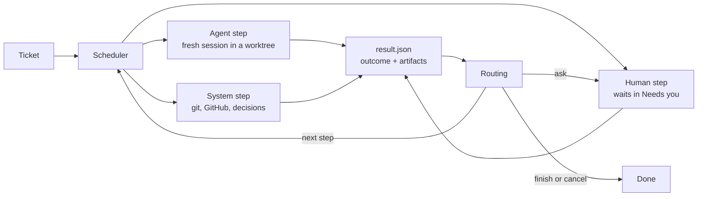

# Architecture

## Concepts

| Concept        | Meaning                                                                                                       |
| -------------- | ------------------------------------------------------------------------------------------------------------- |
| **Ticket**     | One unit of work. It targets one repository, may read others, and runs one workflow version.                  |
| **Workflow**   | A named, versioned list of steps with routes. Stored by content hash, so edits never change a running ticket. |
| **Step**       | An `agent`, `human` or `system` step. It reports one outcome when it finishes.                                |
| **Role**       | A fixed kind of agent with its own instructions, permissions and outcomes.                                    |
| **Action**     | A fixed kind of system work, configured with `with`.                                                          |
| **Capability** | Something a repository's kit provides, such as `setup` or `verify`. Steps declare what they need.             |
| **Kit**        | The `.kipster/` folder in a repository: how to set up, run, verify and merge it.                              |
| **Decision**   | A fast typed judgement (a choice with probabilities and a confidence) used where input is unstructured.       |

Roles: planner, builder, tester, reproducer, reviewer, writer, onboarder.
Actions: decide, maintain-pr, merge, split, wait-children.
The catalog in `src/domain/catalog.ts` is the single list of each.

## Principles the design enforces

- **One fresh agent session per step.** Steps share artifacts and the branch,
  never a conversation.
- **Typed outcomes drive routing.** Agents finish by reporting an outcome from
  their role's list; the engine never parses free text to decide where to go.
- **Agents propose, the system acts.** Only system actions push, open pull
  requests or merge.
- **Nothing judges its own work.** The tester never wrote the change, and its
  edits are discarded.
- **Every loop is bounded.** A step with a `limit` stops sending the ticket
  back once it reaches the limit.
- **A verdict belongs to one commit.** New commits or a moved base branch void
  it.
- **Hard rules before AI decisions.** Paths that always need a human are
  checked first; a decision only chooses within what the rules allow, and an
  unsure decision goes to a human.

## Modules

```
src/
  domain/       Pure rules: catalog, workflow parsing and validation, routing,
                the ticket lifecycle and the records the API returns.
                No I/O; the web app imports its types.
  library/      Loads and versions workflow files.
  store/        PostgreSQL access and append-only migrations. The only place
                that writes SQL; the engine and API call its functions.
  api/          HTTP API (Hono) and the response contract shared with the web app.
  server.ts     Composes the store, library and API into a running factory.
  cli.ts        `kf serve | migrate | check`.
  config.ts     Factory home and config.json.
web/            React app: what needs you, workflows, and later tickets.
workflows/      Built-in workflow library.
scripts/        Development and test PostgreSQL clusters.
tests/          Unit and integration tests (node:test) and browser tests (Playwright).
```

Modules added by later slices sit beside these: `engine/` (the scheduler that
runs steps), `executors/` (Claude Code and Codex, later kips), `workspace/`
(repository cache and per-ticket worktrees), `github/` (pull requests, checks,
comments), `kit/` (reading `.kipster/`) and `decider/` (typed decisions). They
are part of the factory, not plugins.

## Data flow



## Ticket lifecycle

A ticket runs one step at a time as a series of **attempts**; the database
allows at most one open (pending, running or waiting) attempt per ticket.
`src/domain/lifecycle.ts` decides every move and `src/store/tickets.ts` applies
it, with its artifacts and events, in one transaction.

- Agent and system steps start as `pending`. A scheduler claims them, marks
  them `running`, then completes them with a `StepResult` or fails them.
- Human steps start as `waiting` for you: approved, changes-needed (with a
  comment) or rejected.
- An outcome routed to `ask`, a failed attempt, or a second interruption in a
  row opens a `waiting` ask at that step. You retry it, move to any step, or
  cancel, optionally with a note.
- A merge step can wait for its pull request to be merged, then complete.
- Limits count finished runs of a step; interrupted attempts and asks do not
  count. An interrupted attempt is retried once automatically.
- The ticket's status comes from its latest attempt: queued, running,
  needs-you, done or cancelled.

Every write appends events. `GET /api/events` streams them with Server-Sent
Events, and a client that reconnects with Last-Event-ID misses nothing.

## Repositories on disk

A repository is cloned once into the factory home and kept: setup, caches and
secrets persist. Each ticket gets its own worktree and branch for its lifetime.
Each verification gets a disposable checkout of the exact commit, its own
database copy and ports, and is thrown away afterwards; only the evidence is
kept. Other repositories a ticket reads are cached read-only.
