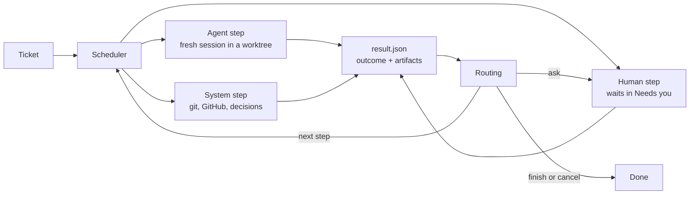

# Architecture

## Concepts

| Concept        | Meaning                                                                                                                                       |
| -------------- | --------------------------------------------------------------------------------------------------------------------------------------------- |
| **Ticket**     | One unit of work. It targets one repository, may read others, and runs one workflow version.                                                  |
| **Workflow**   | A named, versioned list of steps with routes. Loaded from a file or uploaded. Stored by content hash, so edits never change a running ticket. |
| **Step**       | An `agent`, `human` or `system` step. It reports one outcome when it finishes.                                                                |
| **Role**       | A fixed kind of agent with its own instructions, permissions and outcomes.                                                                    |
| **Action**     | A fixed kind of system work, configured with `with`.                                                                                          |
| **Capability** | Something a repository's kit provides, such as `setup` or `verify`. Steps declare what they need.                                             |
| **Kit**        | The `.kipster/` folder in a repository: how to set up, run, verify and merge it.                                                              |
| **Decision**   | A fast typed judgement (a choice with probabilities and a confidence) used where input is unstructured.                                       |
| **Task**       | Work a lead hands out. It runs as a child ticket and lands on the lead's branch or as its own pull request.                                   |

Roles: planner, builder, tester, reproducer, reviewer, writer, onboarder, lead.
Actions: decide, verify-kit, maintain-pr, merge, run-tasks.
The catalog in `src/domain/catalog.ts` is the single list of each.

## Principles the design enforces

- **One fresh agent session per step.** Steps share artifacts and the branch,
  never a conversation.
- **Typed outcomes drive routing.** Agents finish by reporting an outcome from
  their role's list; the engine never parses free text to decide where to go.
- **Agents propose, the system acts.** Only system actions push, open pull
  requests or merge.
- **Nothing judges its own work.** The tester never wrote the change, and its
  edits are discarded.
- **Every loop is bounded.** A step with a `limit` stops sending the ticket
  back once it reaches the limit.
- **A verdict belongs to one commit.** New commits or a moved base branch void
  it.
- **Every integration is optional.** The factory works without it. A missing
  TypeSafe key never fails a ticket: the decision goes to the owner.
- **Hard rules before AI decisions.** Paths that always need a human are
  checked first; a decision only chooses within what the rules allow, and an
  unsure decision goes to a human.

## Modules

```
src/
  domain/       Pure rules: catalog, workflow parsing and validation, routing,
                the ticket lifecycle and the records the API returns.
                No I/O; the web app imports its types.
  library/      Loads and versions workflow files and uploaded workflows.
  store/        PostgreSQL access, append-only migrations and private clusters.
                The only place that writes SQL; the engine and API call its functions.
  api/          HTTP API (Hono) and the response contract shared with the web app.
  engine/       Scheduler, context packets, step execution and system actions.
  executors/    Fresh Codex/Claude CLI sessions and process-group supervision.
  kit/          Zod kit validation and committed default-branch capability discovery.
  verification/ Disposable exact-commit instances, ports, databases and retained logs.
  artifacts/    Content-based media detection for evidence.
  workspace/    Repository caches, ticket worktrees and ownership-aware cleanup.
  github/       Small gh-backed PR interface.
  roles/        Base instructions for each catalog role.
  server.ts     Composes the store, library, engine and API into a running factory.
  cli.ts        `kf setup | start | stop | status | logs | update | secret | serve | migrate | check`.
  config.ts     Factory home and config.json.
  setup.ts      Guided setup: tool and GitHub checks, database, port and agent default.
  service.ts    The macOS launchd user agent that runs `kf serve` in the background.
web/            React app: what needs you, workflows, and later tickets.
workflows/      Built-in workflow library.
scripts/        Development and test databases, demo data and the release bundle.
install.sh      Installs or updates a release bundle on macOS.
tests/          Unit and integration tests (node:test) and browser tests (Playwright).
```

Slice 3 extends the GitHub interface with CI/checks and feedback. Later slices
`decider/` provides typed decisions in Slice 4. These are part of the factory, not plugins.

## Data flow



## Ticket lifecycle

A ticket has one lifecycle cursor, represented by a scheduled **attempt**.
An adjacent tester/reviewer pair runs concurrently: the tester owns the cursor
and the reviewer has a separate linked running attempt. Migration 018 permits
that one sibling while retaining one open cursor per ticket. Both remain running
until the join records their verdicts and opens one next attempt atomically.
`src/domain/lifecycle.ts` decides every move and `src/store/tickets.ts` applies
it, with its artifacts and events, in one transaction.

- Agent and system steps start as `pending`. A scheduler claims them, marks
  them `running`, then completes them with a `StepResult` or fails them.
- Human steps start as `waiting` for you: approved, changes-needed (with a
  comment) or rejected.
- An outcome routed to `ask`, a failed attempt, or a second interruption in a
  row opens a `waiting` ask at that step. You retry it, move to any step, or
  cancel, optionally with a note.
- `run-tasks` parks as `tasks` while a lead's tasks run, without an executor
  slot. A task change finishes it with `reported`.
- Builders park as `other-repo` while their linked ticket runs. A confirmed
  merged PR queues a fresh attempt of the same builder; cancellation asks the owner.
- CI and merge steps park while waiting for GitHub; neither holds an executor
  slot. CI completion resumes routing; merge also watches for owner feedback.
- Limits count finished runs of a step; interrupted attempts and asks do not
  count. An interrupted attempt is retried once automatically.
- The ticket's status comes from its latest attempt: queued, running,
  needs-you, done or cancelled.

Every write appends events. `GET /api/events` streams them with Server-Sent
Events, and a client that reconnects with Last-Event-ID misses nothing.

### End-of-ticket summary

Migration 015 stores the latest fact-based ticket summary and its timestamp.
`store/tickets.ts` writes it inside the status transaction for `done`,
`cancelled` and `needs-you`, including repeated parks and initial human waits.
Merge gate changes refresh a parked report under the same ticket lock.
`ticket.summary` events invalidate the live list and detail. Existing tickets
keep a null summary until their next park or completion.

The pure `domain/summary.ts` function uses status/ask reasons, attempt times,
retry counts, task states, tester/reviewer outcomes, typed decision counts,
skipped steps, scenario evidence and merge gate facts. Agent summaries,
descriptions, findings and decision explanations never enter the report.
The API adds the summary to listed tickets and ticket detail. Ticket pages
show it above the details. Today gives each owner ticket one row, with a lead's
sub-tasks folded underneath; owner rows that need the owner and factory-merge
rows carry the summary pill and one-line activity, queued and running rows keep
their live line, and the collapsed Finished list has no summary pill. Reports
hide while a ticket resumes running.
`domain/tasks.ts` `replacements` derives which ended task a later task with the
same key stem replaced; the summary, the listed child's `task.replacedBy` and a
child's `parentTask.replacedBy` use it.

### Lessons

Migration 017 stores proposed, accepted, rejected and retired lessons per
repository, or with a null repository for the engine. The lifecycle summary hook
proposes them in the same transaction, without changing routing or waiting state.
The pure `domain/lessons.ts` uses finding titles repeated in distinct
`changes-needed` reviewer rounds, repeated recorded attempt errors (including
child attempts and system-recorded task startup/integration errors), and comments on human `changes-needed` or `rejected` answers.
It never reads agent summaries or task result prose. CLI crashes and result.json
validation failures become engine lessons; other errors stay with the repository.
Cross-ticket review finding aggregation is not implemented.

Texts collapse whitespace and stop at 200 characters. Dedup keys use the source
and normalised fact text, bounded to 240 characters. A unique scope/key index
also suppresses rejected and retired lessons on later parks. `GET /api/lessons`
filters by numeric `repository` (or `engine`) and `status`; POST endpoints under
`/api/lessons/:id` accept, reject or retire (with a nonempty `reason`). Decisions
emit `lesson.decided`; proposals emit `lesson.proposed`. Accepting a 31st
repository lesson returns a conflict asking the owner to retire one first.
A scope advisory lock serialises concurrent accepts. Engine lessons have no cap.

Before each agent invocation, the shared prompt builder writes accepted
repository lessons followed by engine lessons to the step directory's
`lessons.md`. This includes indexed parallel reviewers, proof retries and PR
writers. Only an absolute-path pointer goes into the prompt; no accepted lesson
text is embedded. With no accepted lessons, the file and pointer are absent.
Each step takes a fresh snapshot, so owner decisions affect subsequent steps.
Today offers compact Accept/Reject controls. Repositories lists accepted lessons
with a retirement reason form. These controls never gate ticket work.

## Repositories on disk

A repository is cloned once into the factory home and kept: setup, caches and
secrets persist. Each ticket gets its own worktree and branch for its lifetime.
Each verification gets a disposable checkout of the exact commit, its own
empty PostgreSQL database (when requested) and ports, and is thrown away afterwards; only the evidence is
kept. Other repositories a ticket reads are cached read-only.

## Step engine (Slice 1)

`server.ts` starts `engine/scheduler.ts` alongside the HTTP API. Before any
recovery or claiming, the scheduler acquires a **session-level PostgreSQL
advisory lock** through `store/scheduler.ts`, on a dedicated connection held
until work stops. A second factory on the same database refuses to start.
Losing that connection stops claiming and aborts active processes; restart the
factory to recover. Only `store/` contains SQL. No API response shapes changed.

Startup calls `interruptRunning`: abandoned claims are released, and running
attempts follow the lifecycle's retry-once interruption rule. The scheduler
claims up to `concurrency` attempts across tickets, wakes on the events NOTIFY,
and polls every 15 seconds as a fallback. CI- and merge-waiting attempts consume no
executor slot; their GitHub states are checked about once a minute. Both waits
survive a restart. CI has an immediate first snapshot and a persisted timeout. Cancellation
notifications abort the running step independently of slow cloning or GitHub
requests. Shutdown stops claiming, terminates active process groups, waits for
exit and records interruptions before releasing the lock. A restart resumes
through the existing lifecycle, never through a saved agent conversation.

`executors/process.ts` launches commands through a small Node supervisor. Each
command has its own POSIX process group. A timeout, cancellation or shutdown
kills the entire group. IPC disconnect also kills it if the factory crashes
(including SIGKILL); descendants are terminated when the leader exits. If a group kill reports `EPERM`, the supervisor checks the OS process table:
only a group with no live members counts as already stopped. A permission
failure with live members still fails the attempt. Git commands skip the
supervisor because they are short and frequent, and a Node start per call
dominated run time. They still get their own group, killed on timeout,
cancellation or shutdown, but a git command in flight when the factory crashes
runs to completion. The supervisor is not a sandbox. Agents use the owner's CLI logins, environment,
configuration and unrestricted tools on the Mac. Role instructions reserve
pushes and GitHub mutations for system steps.

### Configuration

`kf serve --home <directory>` chooses the factory home (default
`~/.kipster-factory`) containing `config.json`:

```json
{
  "port": 4600,
  "concurrency": 2,
  "stepTimeoutMinutes": 120,
  "agents": {
    "default": { "cli": "codex" },
    "roles": {
      "planner": { "cli": "claude", "model": "sonnet" },
      "builder": { "cli": "codex" }
    }
  }
}
```

`concurrency` is a positive integer; `stepTimeoutMinutes` is positive and covers
workspace preparation and both result-file tries within the same attempt.
Omitted agent settings use Codex. A role entry replaces the default selection;
its optional `model` is passed to that CLI, and its optional `effort`
(`minimal`, `low`, `medium`, `high`, `xhigh` or `max`) becomes Claude's
`--effort` or Codex's `-c model_reasoning_effort`. `agents.reviewers` defaults to an empty list. It selects the parallel reviewers
for a lead final review; a workflow `reviewers` list overrides it. `cli` is the
model family, so Settings warns when entries share a CLI. `agents.allowed` lists the
exact `{ cli, model, effort }` choices a lead may give a task; it is empty by
default, so tasks use the role settings. Accepted CLI names are `codex` and
`claude`; accepted role keys come from the catalog. `allowedOrigins` retains its
existing meaning. The existing `--database-url` shortcut runs with defaults
instead of reading `config.json`. The defaults are concurrency 2, a 120-minute
step timeout and Codex for every role.

#### Settings page

The web app's Settings page (`#/settings`, `GET`/`POST /api/settings`) edits
`concurrency`, `stepTimeoutMinutes` and `agents` (default, roles, allowed and reviewers)
while the factory runs, plus per-workflow overrides of role agents, reviewer
lists and the step timeout. Workflow names retained by stored tickets remain available for overrides
after their files are removed; they do not reappear on New ticket. Until the
owner saves, the factory uses the `config.json` values (or
the defaults) and the API reports `source: "config"`. The first save stores the
whole document in the single-row `settings` table (migration 012); from then on
the database owns these fields, `config.json` values for them are ignored and
`kf serve` logs that at startup. `evidenceRetentionDays`, `port`, `databaseUrl`
and `allowedOrigins` stay in `config.json`. A saved row that no longer parses is
logged and the `config.json` values apply.

The scheduler reads the settings on every tick. Concurrency applies to the next
claim; a lower value never stops running steps. Each attempt takes a snapshot
when it starts: its step timeout and every agent choice in that attempt come
from that snapshot, so a running step keeps the values it started with.
Post-merge checks use the global step timeout.

An agent step's agent is, in order: a lead task's `agent` (child builder steps
only), the workflow override for the role, the global role setting, then the
default. Testers, reproducers, reviewers and writers of a child ticket never take
the task's agent, so review can come from another model family than the author.
The step timeout is the workflow override, then the global value. Overrides are
keyed by workflow name; saving accepts names in the library or retained by
stored tickets, so retired workflows keep their agent and timeout overrides.
The step schema is unchanged. Each started agent attempt records the choice it ran with
(`Attempt.agent`), which the ticket page shows next to the step.

Without `databaseUrl`, the factory runs a private PostgreSQL cluster in
`<home>/postgres`. It listens only on a Unix socket in a `0700` directory under
`/tmp` (socket paths are limited to about 100 bytes). `kf serve` and `kf migrate` start it
when it is not running and stop it on exit if they started it. An installed
release uses its bundled PostgreSQL; a source checkout uses PostgreSQL 18 on
`PATH`. Set `databaseUrl` (or pass `--database-url` to setup) to use your own
database instead.

### Installation and releases

A release is one archive per Mac architecture, built by `scripts/bundle.ts`:
the app with production dependencies and the built web app, Node.js and
PostgreSQL, each download pinned by SHA-256. `install.sh` verifies the archive
against the release `SHA256SUMS` and unpacks it to `<home>/versions/<version>`. It points
`<home>/current` at it and keeps the previous version for rollback. It links
`kf` into `~/.local/bin` and runs `kf setup --start`. `kf start` writes a
launchd user agent that runs `kf serve` at login with the `PATH` captured at
that moment, so agents find `gh`, `codex` and `claude`. Updates stop the
service before replacing the version. A push to `master` publishes
`v<package.json version>` as a release unless it already exists
(`.github/workflows/release.yml`). Pull
requests touching installation build and smoke-test both bundles without
publishing.

Verified against installed Codex **0.160.0** and Claude Code **2.1.289**:

- Codex: `codex exec --dangerously-bypass-approvals-and-sandbox --ephemeral --json -`
- Claude: `claude --print --dangerously-skip-permissions --no-session-persistence --output-format stream-json --verbose`
- Both accept an optional `--model <model>`; prompts go through stdin. Neither
  command resumes a session or restricts tools. Stdout and stderr stream to an
  on-disk log recorded as an artifact before launching, including failed runs.

`kf serve --no-scheduler` and `npm run dev -- --no-scheduler` serve the UI/API
without executing tickets. Demo seeding holds the scheduler's advisory lock,
requires an empty database and permanently marks it as demo before inserting
fixtures. A scheduler refuses that database before recovery or cloning. Migration
003 also recognizes existing demo-shop data. Development uses `.local/factory`
by default so its database and workspace IDs stay together across checkouts.

### Workspaces and evidence

`workspace/` serializes Git operations per repository. Registered pending
repositories are cloned and marked ready or failed through the store. A failed
repository keeps its error until the owner retries it (`POST
/api/repositories/:id/retry`, Retry on the Repositories page), which returns it
to pending. The cache's
`origin/HEAD` supplies the default branch; attempts also repair old registrations
that assumed `main`. The cache
is kept at `repositories/<repository-id>/repo`; ticket worktrees live at
`worktrees/<ticket-id>/repo`, on the ticket's `kipster/<number>-<slug>` branch.
Before creating a ticket worktree, the cache fetches origin and branches from
`origin/<defaultBranch>`. Later steps and restarts reuse that worktree and branch.
An ownership record ties each path to its repository/ticket; pre-existing paths
without a matching record are never adopted.

Only terminal (`done` or `cancelled`) tickets are eligible for removal, after
their executor has exited. Cleanup uses `git worktree remove` without force and
keeps branch references. Dirty, untracked or locked worktrees are retained for inspection. Cleanup removes
only ignored directories named `node_modules`, `dist`, `build`, `coverage`,
`playwright-report` or `test-results`, after checking ownership, branch, locks,
tracked content and symlinks. All other ignored files retain the worktree.
The database records successful removal (or an already absent worktree), so
subsequent passes and restarts skip it. Cleanup also removes the ticket's agent
scratch directory, `steps/<ticket-id>`, even when the worktree is retained, and
the emptied `worktrees/<ticket-id>` folder; a symlinked scratch directory is left
alone. The cache is retained; recorded files are owned by the per-ticket evidence store. `maintain-pr` synchronizes branches
with the fetched base and watches CI (Slice 3). Kit
capabilities are refreshed from committed default-branch blobs after each cache
fetch; workflows needing missing capabilities remain gated by the store.

### Prompt and result contract

`engine/prompt.ts` combines `roles/<role>.md`, step `instructions`, the
repository's optional `.kipster/roles/<role>.md` and `.kipster/context/index.md`
(both from the fetched default branch, the index capped at 8,000 characters), and
a context packet. The packet includes
the title/body, latest plan before human approval (labelled unapproved until
approval), prior step summaries and findings with attempt IDs, human comments
and notes, branch and diff statistics. Each role runs in a new CLI session.
Planners supply acceptance scenarios and never commit; builders implement and
commit; reviewers read the diff once, block only serious problems and leave
minor notes in the summary. Writers provide PR prose as note artifacts.
Planner, reviewer and writer changes to the ticket worktree fail for human
inspection and are preserved. Tester and reproducer sessions instead use
disposable checkouts, as described in Independent proof below.

The factory writes the prompt to
`steps/<ticket-id>/<attempt-id>/<try>/prompt.md`, outside the repository, and
instructs the agent to write `result.json` beside it. A copy of each prompt is
recorded as a log artifact (`<role> run <try> prompt`), so it outlives the scratch
directory and follows log retention:

```json
{
  "outcome": "done",
  "summary": "Implemented and verified the approved change.",
  "artifacts": [
    {
      "kind": "evidence",
      "title": "Verification",
      "content": "Commands and observed results…"
    }
  ]
}
```

All three keys are required; a passed reviewer may also supply the typed
`ownerReview` field described below. Outcomes must belong to the role's catalog contract
or be `needs-decision`. Summary is nonempty. Artifacts use the existing lifecycle
schema: kind (`plan`, `comment`, `finding`, `evidence`, `log`, `note`), title, and
exactly one of Markdown `content` or a `path` to an existing file under the
factory home. Symlink escapes are rejected. File artifacts are copied into `evidence/<ticket-id>/` before recording, so scratch and worktree cleanup cannot erase evidence.
Artifact titles and scenario labels over 200 characters are shortened, not
rejected. A successful planner must include a plan artifact. Missing or invalid results
get one fresh CLI retry in a separate directory with the previous validation
failure in its prompt; proof retries still receive fresh instances and must
capture new evidence. A second invalid result fails
the attempt and opens a human ask. Timeouts fail immediately. Chat text is never
parsed for routing. Logs survive failures and cancellation.

### System actions and verification

`maintain-pr` requires a clean worktree. Workspace preparation fetches origin;
the action pins `origin/<defaultBranch>`, then fetches the remote ticket branch
if it exists. Commits missing locally are merged into the ticket branch before
merging the pinned base. It never rebases or force-pushes. An outside-commit
conflict is aborted and reports `needs-decision`, naming the outside commits
(short SHA, subject and author) and conflicting files. A base conflict is aborted
and reports `conflict` with a finding listing the files for the builder.
After clean merges, a prior tester or reviewer execution must be a passing verdict
for the exact resulting HEAD;
otherwise `base-moved` routes back to testing, or review when there is no tester.
This check also catches a restart
after the merge committed but before its outcome was recorded. Workflows without
a tester can still publish after refreshing any prior review. A branch with no commits ahead asks the owner.

Before publishing a new head, `engine/pr-writer.ts` runs the writer in a fresh
session using the writer's configured CLI and kit instructions. The writer is guided to
explain the change and why in an inline note, describe current-commit scenario evidence in the factory,
optionally include a small Mermaid diagram, identify `Verified at <sha>`, and
state `Merge danger:` with a one-way/two-way door and blast radius, aim for 150–250
words and keep it under 4,000 characters, name the factory ticket and omit local
evidence links. These are instructions only; the factory publishes the first
non-empty inline note from a successful `done` result without checking its wording.
CI is still pending at this point; the prose describes its status at
writing and directs readers to current checks rather than making a lasting status claim.
The factory appends untested warnings and open review findings to writer notes,
cached descriptions and fallback descriptions, and records the full annotated
note and run log on the ticket. It caches the description by ticket and head.
It trims last, only if the annotated description plus factory marker exceeds GitHub's
65,536-character limit, ending with `Full description on ticket #<n> in the factory`
and preserving the full note on the ticket. When a run produces no usable note
(including a crash, missing or invalid result, or `needs-decision`), it retries
once in a fresh session, then publishes a factory description from the ticket,
tasks or commits, and latest tester and reviewer verdicts. Worktree edits still
stop publication; aborts and infrastructure failures propagate.
Full plans, logs and prior review rounds remain in the factory timeline.

The action pushes normally, creates or updates the branch PR through `gh`, and
persists its URL. Only an open PR is reused; if only closed or merged PRs exist,
it creates a new one. It parks as `pull-request-checks`, recording the pushed commit
and waiting timestamp, and
immediately takes one check snapshot. Pending checks are subsequently polled
without an executor slot. The GitHub adapter queries the exact SHA via `gh api`,
paginates checks, and checks branch protection/rulesets for required checks not
yet reported. Required checks must pass (GitHub also accepts neutral/skipped
runs). Without required checks, all reported checks are considered. Only those
checks are awaited, but any reported check that completed with a failure
(required or not; any conclusion other than success, neutral or skipped, or a
failure/error status) reports `ci-failed` and blocks the merge gate. A
non-required check still pending once the awaited checks pass is not awaited. No checks waits for `ciSettleMinutes` (default 3) after the push before treating the repository as having no CI. A changed local/remote head asks the owner rather than
accepting another commit's green CI. Failed checks report `ci-failed` with names,
links and at most 2,000 characters of log per check. Actions logs come from
`gh run view --job --log-failed`; other providers use their supplied summary/text,
and unavailable logs are explicitly labelled. API errors leave the wait intact;
the deadline still applies.

The owner-merge wait refreshes the merge gate from the checks on the open pull
request's head at every poll. If one has failed, typically a non-required check
still running when maintain-pr reported `ready`, the waiting merge attempt
finishes `changes-needed` with the same `CI failed: <names>` summary and
findings (`pull-requests.ts:ciFailure`) before feedback, base movement or
auto-merge are considered. Built-in workflows route that to the builder (or
lead). Pending, passed or absent checks and a changed head do not route from
this wait.

CI and owner-merge waits also fetch the default branch. If it contains commits
missing from the ticket, the lifecycle closes the obsolete wait and queues a
fresh attempt of the most recent `maintain-pr` step. This works with the ticket's
saved workflow version. Polling itself neither merges nor starts a writer;
normal scheduler capacity controls that work. Maintenance merges the base and
requires a fresh tester verdict for the resulting commit before republishing.
Standalone merge workflows without prior maintenance retain their existing
behavior, and new review feedback still goes to the builder first.

Configure `maintain-pr` through `with`, for example:

```yaml
with:
  ciTimeoutMinutes: 60
  ciSettleMinutes: 3
  maxBaseSyncs: 3
```

The timeout defaults to 60 minutes and reports `needs-decision` to the owner.
Evidence stays on the ticket until hosted attachments are configured in a later slice. The `factoryUrl` parameter has been removed. Migration 005 adds
the CI waiting value and the description cache. No step fields are added.

`merge` parks as `pull-request-merge`. Polling reports `merged` or `rejected`
when the factory or owner merges it, or the owner closes it. For an open PR it also reads paginated reviews,
issue comments and inline review comments via `gh`. A current change-requesting
review from a human, or a new owner comment, reports `changes-needed`; feedback
becomes comment artifacts with source links for the builder. The owner is the
repository owner, a commenter with OWNER association, or the authenticated factory
operator (including organization repositories). Bots and factory-marked content
(`<!-- kipster-factory -->`) are ignored; author identity alone cannot distinguish
a human from the factory using the same CLI login. Comment artifacts carry source
IDs so retries/restarts and later merge waits do not replay consumed feedback.
Superseded/dismissed change requests are ignored. Only the system merge policy described below may invoke `gh pr merge`. Other system actions explicitly fail to a human in this slice.

`tests/pull-requests.test.ts` uses real PostgreSQL, local bare remotes, a fake
writer and a stub GitHub interface to cover clean/conflicting merges, stale
verdicts, CI outcomes/timeouts, restart and executor-slot release, writer caching
and feedback deduplication. `tests/github.test.ts` checks pagination, required
checks, non-required failures and pending checks, bounded log excerpts and
feedback filtering. These do not prove live
GitHub publication, CI propagation timing, provider permissions or feedback
round trips by themselves. The live factory-floor acceptance run additionally
exercised onboarding, real feature and base/head bug evidence, required CI waits,
writer publication, owner feedback and merges, and base movement with fresh proof.
See the [roadmap](roadmap.md) for the acceptance scope and remaining limits.

`tests/engine.test.ts` uses a scripted executable, real PostgreSQL and local bare
Git repositories, with GitHub calls substituted behind the interface. It covers
a test-local approval/review loop, merge waiting, failure/retry, process-group
timeout/cancellation, crash recovery, lock exclusion, concurrency and ownership.
`node scripts/live-engine-check.ts [source-repository]` is an explicit opt-in
smoke check using the real default CLI: it clones the source into a temporary
home, removes its remote, runs planner and builder, validates both results and
checks the local commit. It retains evidence and never pushes. Real GitHub
publication/merge and Claude execution are not exercised by that smoke check.

## Proof foundation (Slice 2A)

The complete kit, harness and consumer contract is in [docs/kit.md](kit.md).
`.kipster/kit.yml` declares version 1, optional setup, deterministic check, and an
optional verify block (start, ready, ports, database, timeoutSeconds). Verification
README and structured feature maps are validated alongside the block. Optional
roles/<role>.md prompt additions and the context/index.md map are read from the
trusted default branch for every role. The onboarder receives the
kit guide in its prompt. The cache fetch refreshes the default branch, kit status
and capabilities together; an invalid kit clears capabilities with a diagnostic.

`verification/startVerification` (implemented in `verification/harness.ts`) creates
an isolated detached clone of the exact commit inside factory home, runs setup,
optionally check, reserves ports, creates a fresh database on the factory's own
PostgreSQL server when requested, starts a supervised process group and polls a
local readiness URL for 2xx. Agents never own instance startup or shutdown.
Callers receive URL, ports, nullable databaseUrl, checkout, retained evidenceDir,
log artifact inputs, an exited promise and an idempotent stop(). Stop terminates
that group, drops its generated database and removes the disposable clone.
Failures name their stage and retain available logs; SIGKILL process cleanup is
supervised but orphaned database/checkout recovery is deferred.

`verify-kit` runs the ticket HEAD's candidate kit with check enabled, stops it,
and reports passed/failed with logs and a stage finding on failure. It cannot
change default-branch capabilities. Onboarding is write-kit → verify-kit →
approve-kit → maintain-pr → merge, with failed verification routed back to
write-kit up to three runs. Human approval remains required. Feature-map semantic
proof belongs to the independent tester; boot readiness alone does not prove it.

Migration 004 adds `Artifact.mediaType`, `Attempt.headCommit`, and repository kit
status/error (capabilities reuse the existing column). The API adds
`Repository.kit: {status, error, capabilities}` and retains the old capabilities
alias. File signatures detect image/video types; text is inert Markdown/plain
text/JSON, unknown binary is application/octet-stream. The artifact endpoint
uses the detected content type with the existing path containment, nosniff and
sandbox CSP. Ticket responses resolve legacy file media types too. Inline
artifacts are text/markdown. Attempt commits are supplied by the factory at
completion, independently of agent JSON; legacy/unobserved commits remain null.
Consumers must compare verdict commits to the current branch, never infer
freshness from a summary or a null commit. Slice 3 checks verdict freshness against the synchronized branch HEAD before
publication and routes stale verdicts back to testing.

`seed:demo` generates synthetic image, WebM and log files inside the selected
home, and includes valid/invalid kits plus passed/current and stale lead
verdicts without running an engine. `npm run dev` keeps the factory alive during
source edits; explicit restart loads changes. `npm run dev -- --watch` opts into
restarts. Web hot reload remains enabled in either mode.

The demo also seeds three `task-pr` tickets whose CI outcome comes from product
code rather than written facts: `inspectChecks` runs against fixture `gh` output
supplied through its injected command runner, and maintain-pr's `checksResult`
gives the outcome that `completeAttempt` routes. "Bundle check failed on the pull
request" has a failed non-required `Bundle` check and sits back at build with the
check's link and log excerpt; "Optional check still running" has `Bundle`
pending and reported ready. "Bundle check failed while waiting to merge" was
ready with `Bundle` pending, then a second snapshot has `Bundle` failed and its
merge attempt finishes `changes-needed` with `ciFailure`'s findings, the result
the merge wait gives, so it is back at build. Their merge gates come from
`evaluateMergeGate` over the inspected checks. The served instance never calls
GitHub, and the merge readiness card labels each check required or not required.

Two lights-out leads show every task being checked. One is in `kipster/docs-site`,
whose valid kit has no verify block; the other is in demo-shop. Their state comes
from the real lifecycle: `claimAttempts` routes each task's build to its `test`
and each lead's `done` to `final-test`. Each task's result is
`mergedTaskResult` over `checkerVerdict` of the stored child, the same text
`integrate` writes. Each lead's merge gate is `evaluateMergeGate` over identical
facts plus `untestedReasons` of the stored lead, so only the docs-site gate lists
the checker's unverified item. The agent results are synthetic.

Each owner action has its own waiting demo ticket: three plans (to approve,
change and reject) and three review-limit asks (to retry, move and cancel), so
every verification scenario runs on one seeded instance.

## Independent proof (Slice 2B)

Tester and reproducer steps use `engine/proof.ts`, separate from ordinary agent
execution. The factory resolves immutable object IDs after fetching the base,
loads the trusted base commit's kit, README, feature maps and role additions,
and starts the harness before invoking a fresh agent session. A tester runs in
a disposable detached checkout of the ticket HEAD; a reproducer runs on the
base branch HEAD. Neither uses the builder's worktree. Local edits and even
accidental local commits disappear with the disposable clone, which has no
remote; nothing copies them back to the ticket branch. This is isolation from
the normal publication path, not an OS sandbox for an unrestricted agent.

The prompt includes the exact commit, instance URL, database URL, evidence
directory, verification documents and the approved plan's acceptance scenarios.
All maps are supplied so a relevant entry point cannot be lost to heuristic
selection. The agent drives the actual user surface first; state inspection may
only corroborate that run. Wrong surfaces, stale builds and self-reports cannot
pass. A skipped or inconclusive scenario stays unverified and is reported with
`scenarioResult: unverified`; the tester outcome may still pass, and the merge
gate shows the change as untested. The factory validates
nonempty evidence files in the current instance's evidence directory, excluding
startup logs. A `changes-needed` result requires findings naming Scenario,
Observed, Expected and an attached Evidence filename. These checks enforce the
shape and provenance of evidence; judging whether it proves the scenario remains
the independent agent's job.

A feature tester always runs. When the trusted kit has no verify block, or its
setup or start fails, the factory gives the tester a disposable checkout of the
exact commit without an app (`instances[].url` is null) and adds `app:
{started: false, reason, suggestedCommands}` to the context. A failed start is
recorded on the attempt as logs and a note, not a finding, and does not fail the
step. The tester works out how to check the change itself and still attaches
nonempty file evidence from its evidenceDir. Reproducers and bug testers still
require a started app. A passing tester may report scenarios it could not prove
with `scenarioResult: unverified`; a passing proof still rejects `failed`.

A reproducer returns `reproduced` or `not-reproduced`, with a `Reproduction steps`
note containing exact actions, inputs, observations and evidence. The note is
passed to later steps. `not-reproduced` follows the existing unrouted-outcome
rule and asks the owner without starting a fix. A tester in a workflow containing
a reproducer requires a successful reproduction, then starts **two** isolated
instances: the freshly fetched base and the ticket HEAD. It repeats the same
reproduction against both, requiring the failure on base and success on head,
with separate evidence files and databases. If the base was independently fixed,
the comparison cannot pass.

The agent is raced against both instance lifetimes. Unexpected app exits abort
the agent; success, execution failure, invalid results, timeout and cancellation
all await agent termination and every instance's `stop()` in `finally`. Cleanup
failures fail the attempt rather than report a pass. A malformed/evidence-free
result gets one fresh session with fresh instances, never a contaminated retry.
Evidence and process logs survive checkout removal, including failed/cancelled
runs. Valid result files, including reproduction notes, are copied into the per-ticket evidence store before scratch directories are removed.

`Attempt.headCommit` is pinned by the factory **before** proof execution: the
base SHA for reproduction, the tested ticket SHA for a tester. Disposable agent
commits cannot change that observation. A concurrent ticket HEAD change rejects
the verdict. Successful tester summaries include `Verified at <full sha>` (and
the base/head pair for bugs), which the existing PR description formatter carries
through. `store/verdicts.ts:isLatestTesterVerdictCurrent(database, ticketId, sha)`
returns true only when the latest tester execution, identified by role in the
ticket's immutable workflow, finished with `passed` at exactly that SHA. Null,
missing, pending, failed, interrupted and superseded verdicts cannot count. The
caller must supply the live branch commit; base synchronization and routing back
to test remain the PR-maintenance consumer's responsibility.

`tests/proof.test.ts` runs the harness fixture HTTP application with real
PostgreSQL and a fake agent that actually calls its checkout endpoint and saves
responses. It covers the feature correction loop, bug comparison, owner asks,
trusted instructions, discarded edits, stale verdicts and cleanup.
`node scripts/with-test-database.ts node scripts/live-proof-check.ts` is the
explicit opt-in check with the real default CLI. It runs independent reproducer
and tester sessions against the HTTP fixture, with a deterministic fixture fix
between them, retains local evidence, and never publishes a branch. It does not
verify browser UI proof, Claude, GitHub publication or moving-base routing.

## Guided setup and secrets (Slice 4)

`kf setup` creates or updates the home's config.json, keeping fields it does not
ask about. It validates the PostgreSQL connection (the private cluster unless a
database URL is configured) and migrates it before saving. It shows the active
GitHub account and scopes, offering `gh auth login` when signed out, and warns
about missing Git, gh, Codex and Claude. It asks for the default agent only when
both CLIs are installed and no agents are configured. It asks nothing else, so a
re-run or a machine with one agent CLI needs no input. Scripted setup uses
`--non-interactive`, `--database-url`, `--port` or `--typesafe-stdin`.
TypeSafe is not prompted for; `--typesafe-stdin` validates a key through
GET /v1/models before storing it.

`kf secret set|list|remove` manages named secrets. The pinned @napi-rs/keyring
backend uses service `kipster-software-factory` and the secret name as account;
Linux explicitly selects Secret Service. Unavailable OS storage falls back to
home/secrets.json, written atomically with mode 0600 and a warning. Tests select
`--secret-backend file` and never access OS credentials. macOS is tested; Linux
remains unverified and Windows validation is later. Settings and secrets do not
use .env files or environment variables. A secret is read at the moment of use,
passed explicitly only to its client, and never added to executor environments,
prompts, events, artifacts, logs or API responses. SDK logging is disabled, and
remote error bodies are replaced with safe status/category messages.
Agents run unsandboxed under the same user, so the file fallback (like
config.json) is readable by them; prefer the OS store. Engine key reads stop
waiting after 10 seconds, so a blocked credential prompt sends the decision to
the owner instead of holding an executor slot.

## Typed decisions (Slice 4)

The system `decide` action asks one SDK Choice question using its catalog `with`
parameters. `engine/decision-facts.ts` is the single state builder: ticket title
and body, fetched origin/default base and ticket HEAD, changed paths with added
and removed line counts (null for binary files), latest tester/reproducer/reviewer
verdicts with status and commit, and exact-head CI state when available. Agent
summaries and artifacts are excluded. Unknown CI stays null. This is descriptive
input for workflow judgements; it does not authorize a merge. The separate
merge policy uses hard rules and independent tester/reviewer verdicts.

`domain/decisions.ts` applies inclusive confidence bands (defaults act 0.9,
confirm 0.6). High confidence routes the selected option; medium confidence parks
as `decision` for one-click acceptance or another option; low confidence asks the
owner, displaying probabilities as information only. Missing keys or exhausted
SDK errors use the same owner controls, never fail a ticket. Cancellation and
shutdown signals still stop execution normally. The pinned SDK always receives
an explicit key, base URL, logging setting and `jev-1.13.0`; the log retains the
model version actually returned. SDK retries default to two after the initial
request, with a 10-second timeout per attempt and cancellable backoff.

Migration 006 adds a decision log, one row per attempt. Its JSON input preserves
question, options, thresholds, facts, model response, usage, band, safe fallback
reason and elapsed request time; final choice, decider, override and timestamps
are recorded separately. Logging and routing/parking share a ticket-locked
transaction. An owner answer closes the original system attempt, uses the same
pure option routing and limits as the model, and cannot answer a stale attempt.
Parked decisions survive restart. Cancelled pending decisions stay in the log
but do not appear as needing an answer. Ticket responses add `decisions`; the
option endpoint is separate from the existing human approval endpoint. The
Decisions page lists the latest 100 outcomes with all-time counts grouped by
workflow version and step so different threshold configurations are not mixed.

## Merge gate (Slice 4, Wave 1)

`domain/merge-gate.ts` evaluates facts without I/O. Readiness requires a passing
latest independent tester at the PR head when the workflow has a tester, the current reproduction comparison
for bug workflows, no base commits missing from that head, green required CI (or
explicitly no checks) with no failed non-required check, no unconsumed owner feedback or current change request,
no queued/running work, and an open, non-draft, conflict-free PR. Unknown facts
and failed observations block. Untested workflows have a needs-owner reason, without a readiness blocker, as does each item the latest tester reported unverified. Hard
path rules are separate from readiness: the kit, CI and migrations always need
human review. Custom migration globs only add rules and are loaded from the
fetched default-branch kit. Rename/deletion paths are included. Missing kits use
defaults; invalid trusted kits block.

Existing CI/merge polling stores the latest evaluation and last ready head in
`merge_gates`, without an executor slot. The API adds `mergeGate`; it overlays
new queued/running work and later commit observations to prevent cached green
facts from hiding a rebuild. GitHub errors invalidate readiness while terminal
PR detection can still finish a ticket. The UI separates per-check CI facts from
the writer's historical description. A previous green head remains visible.
Readiness is one input to the opt-in automatic merge policy below.

A reproducer's original verdict remains at its base commit. A successful bug
tester records `reproductionAttemptId` identifying the reproduction it repeated
on both current base and ticket head. The gate uses that comparison's tester
commit as the reproduction's confirmed head, never relabels the original base
verdict, and rejects a different/newer reproduction or tester. Independent proof,
repository checks and approved unverified scenarios remain distinct facts. This
slice has no structured approval data; the UI and writer say it is unavailable.

## Automatic merges and post-merge checks (Slice 4, Wave 2)

Repositories store `autoMerge` in PostgreSQL, off by default. The Repositories
page updates it through `POST /api/repositories/:id/auto-merge`; no config file or
environment variable enables it. With the setting off, the owner merges through
GitHub as before. There is no model or TypeSafe call on the merge path; `decide`
and its decision log remain available for workflow judgements.

The system merges only when the fresh gate is ready with no needs-owner reasons
and the latest independent tester and reviewer verdicts both passed at the exact
PR head. Workflows without a tester or reviewer need the owner (`Untested
workflow` / `Unreviewed workflow`). Kit, CI and migration paths and invalid
trusted kits always prevent a factory merge.

A reviewer can pass with `ownerReview: { reason: "…" }` in its result. The field
is validated, accepted only for a passed reviewer verdict, and stored on that
attempt. At that head the gate shows the reason as a needs-owner condition.
Prose never sets the flag. Reviewers use it for correct changes involving auth,
permissions, data deletion/rewrites, public contracts, sensitive security code or
weakened tests. A flagged pass still proceeds through publication normally. Bug
workflows now review after testing, with changes-needed routed to the fixer and
limit 2.

Immediately before acting, the system fetches and evaluates fresh Git, store
and GitHub facts; a stored green gate is never authorization. The head must
still match, and `gh pr merge --squash --match-head-commit` enforces it at GitHub.
`merge_requests` records the authorized head and gate before the call. Transient
errors remain retryable with fresh facts. If GitHub reports that requested head
merged after a crash or lost response, the factory reconciles the request,
clears the error and records a factory merge. The timeline records the rule
authorization, factory/owner actor and merge commit.

`post_merge_checks` owns one job per repository/merge commit, including owner
merges. Bounded background jobs inspect all reported GitHub checks on the exact
merge commit, independently of PR-only requirements, without occupying executor
slots or holding the scheduler loop. They allow three
minutes for check registration. If PR CI existed but no default-branch checks
appear, they wait up to an hour, then use the kit's deterministic check. A
repository with no CI uses the merged kit's setup/check in the verification
harness's disposable exact-commit checkout, without starting an app. Missing or
invalid kits are recorded as unavailable. GitHub API errors remain retryable;
kit infrastructure failures are persisted and bounded to three attempts, then
recorded as unavailable with the reason. Setup/check failures open a bug. Failing checks open one `bug` ticket in the same repository with check
excerpts, PR and merge commit, and add a linked note to the original timeline.
Bug creation and job completion share a transaction, preventing duplicate bugs
across retries or restarts. The job table has no general ticket-link semantics.

`maintain-pr` counts consecutive base re-syncs. `maxBaseSyncs` defaults to 3;
when the base moves again at the bound, the ticket parks for the owner before
another merge or re-test. Only re-syncs queued from a base-moved PR wait count;
initial publication and maintenance after feedback rebuilds do not. Starting
builder or tester work breaks the streak. A merged PR or an owner retry/move
also resets the count.

## Durable evidence (Slice 4, Wave 1)

Recorded file artifacts are copied to `home/evidence/<ticket-id>/<unique-file>`
before the ticket-locking transaction opens. Newly copied, unreferenced files are removed if preparation or the transaction fails; existing owned live logs are preserved. If a commit acknowledgement is lost, referenced evidence survives; uncertain copies are preserved when the database cannot confirm their state. Sources and destinations are contained in home
with symlink resolution. Engine/harness logs are written directly to their owned
stable files so live logs remain live. Proof records each file's actual base/head
`observedCommit` separately from the attempt verdict; agents cannot provide this
field. After process shutdown and successful retention, proof scratch directories
are removed. Legacy completed files are adopted in bounded background batches;
original legacy files are preserved when their ownership is uncertain.

Result artifacts add optional `scenario` and `scenarioResult` labels. The pure
scenario index chooses one key screenshot, recording or text item per independent
role/scenario from the latest attempt, preferring the requested head. Unlabelled
files remain in the archive. The API adds `evidenceIndex`; stable same-origin
routes `#/tickets/<number>/evidence/<artifact-id>` open items. Older attempts,
additional media and logs are behind the archive. No installation URL or Tailscale
integration is required. Writers are instructed to state `Verified at <sha>`, scenario
observations and `Evidence on ticket #<n> in the factory`, with no local links;
the factory does not validate their wording.

`config.json` adds `evidenceRetentionDays` (positive integer, default 30).
An hourly bounded scheduler background task prunes finished/cancelled ticket logs
and archive evidence after that many days from completion. It retains curated
items at the final commit, never prunes unfinished tickets, and keeps artifact
rows with `prunedAt`/`retentionDays`. The API returns 410 and the UI says “removed
after N days.” Shared retained files and paths outside owned per-ticket storage
are protected. Notes, plans and step metadata remain. Migration 007 adds these
fields, the comparison link, retention bookkeeping and gate snapshots.

## Linked tickets and read-only dependencies (Slice 5)

The builder catalog result adds `otherRepository` for `needs-other-repo`:
registered `owner/name`, nonempty title and body explaining the needed change,
and optional workflow (default `lead`). The agent proposes; the engine creates
and validates the target ticket. Missing registrations, unavailable workflows,
capabilities and malformed requests go to the owner. The step schema is unchanged.

Migration 008 adds `ticket_links`, unique by builder attempt and linked ticket,
including the full repository/title/body/workflow request, and
`ticket_dependencies`, unique by ticket/repository. Creating a linked ticket,
adding its original-repository dependency, and parking the original attempt as
`other-repo` share one ticket-locked transaction. Replaying that builder result
returns its existing link. The linked ticket runs its own workflow version and
approval steps. Both ticket responses show the link and its current status.

The scheduler resolves terminal linked tickets at the merge-poll interval (one
minute by default), without holding an executor slot. Event wakes do not bypass
that interval. Done alone is insufficient: the linked PR must be
confirmed merged with a full merge commit from GitHub. The link records that
commit, a note retains the PR URL, and the lifecycle queues a fresh builder
attempt of the original step with the original builder summary and full request
alongside the PR URL and merge commit. Resolving a link preserves that builder's
summary; the merge or cancellation explanation is a separate note. Cancelled links and completion without confirmed
merge ask the owner. Cancelling the original never cancels the linked ticket and
never resumes the cancelled original. Restart leaves parked attempts intact.

`POST /api/tickets` adds optional `dependencies: ["owner/name"]`. Dependencies
must be registered and distinct from the target; repeated case-insensitive slugs
are deduplicated. Ticket detail responses add `dependencies` and `links`; tickets
with neither retain the existing execution flow. The New ticket form selects
optional dependencies; the Ticket page shows them and explains cancellation.
A parked original displays “Waiting for linked ticket #N” and that ticket's
current status, refreshed on linked-ticket events, with Cancel still available.

Before every agent session, including proof sessions and the PR writer, the
factory fetches each dependency's default branch through its repository cache.
It recreates a detached checkout at that exact commit under
`home/dependencies/<ticket-id>/<repository-id>/repo`, so different tickets cannot
contaminate each other and restart cannot preserve agent changes. The repository
cache retains Git objects; the dependency checkout borrows them through
`.git/objects/info/alternates`, with no object copying, no remote, and only a
default-branch ref. A cache ref at `refs/kipster/dependencies/<ticket-id>` pins
the checkout's commit before use. This keeps its full object graph reachable
even when the default branch is force-pushed and the cache is garbage-collected.
The pin changes only when that ticket prepares its next fresh session, after
the prior executor has exited. Factory caches and their pins must not be
removed or edited externally while dependency checkouts exist; a borrowed
checkout cannot survive deletion of its object source. Ownership checks reject unowned or symlinked directories.
The prompt lists repository, path and full commit and forbids edits or pushes.

Files, directories and Git metadata have read-only permissions. After executor
exit, including execution errors, cancellation and timeout, the engine compares
contents, file modes, symlinks, ignored files, HEAD, refs and checkout
configuration. It hashes once before and once after the session, streaming file
contents and excluding the object database and Git packs. Any difference fails
the step to the owner with changed paths and recreates the checkout at the pinned
commit using the step's signal. If that signal has expired or been cancelled,
the failure explicitly reports that restoration did not finish; the next session
recreates the checkout. The
factory never pushes a dependency. These are ordinary filesystem protections and
post-session detection, not an OS sandbox: unrestricted agents run as the owner
and can deliberately bypass permissions. After an executor has exited, terminal
ticket cleanup makes its owned dependency directories writable, removes them and
releases their cache pins. This also runs when a dirty or locked ticket worktree
must be retained, or when that worktree is already absent. Repository object
caches remain; dependency checkouts do not accumulate for done/cancelled tickets.

## Uploaded workflows

`POST /api/workflows` takes `{ source }`, the YAML text, up to 100,000
characters, with a JSON content type. It validates the source with the same
`parseWorkflow` as workflow files and answers 400 with every error in `issues`.
A name owned by a workflow file answers 409, so uploads never replace the
built-in `lead` that linked-ticket requests default to. Otherwise one
transaction records the version in `workflow_versions` and makes it current in
`uploaded_workflows` (migration 010). The response is 201 for a new name and
200 for a new version of an uploaded one.

The server, API and scheduler share one in-memory library. An upload is added
to it after saving, so new tickets and linked-ticket requests can use it at
once. Running tickets keep their stored version. At startup the factory loads
workflow files first, then each upload's current version. An upload hidden by
a file with the same name, or no longer valid for the current catalog, is left
out with a warning; its rows stay. `GET /api/workflows` adds `origin: file |
upload`. The Workflows page uploads a chosen `.yml` file and lists the issues.

`DELETE /api/workflows/:name` removes an upload: it deletes only the
`uploaded_workflows` row and the in-memory library entry. `workflow_versions`
rows stay, because tickets reference `(workflow_name, workflow_version)` and
load their definition from there, so done and cancelled tickets keep opening
and no migration is needed. A workflow file answers 409, an unknown name 404.
Under a row lock on the upload, the store refuses with 409 and the sorted
`tickets` numbers while a ticket that is not done or cancelled runs it, or an
unfinished lead has a task naming it. A ticket created in the instant before
removal still runs from its stored version. Per-workflow Settings overrides for
the name are kept; if no ticket ever ran it, the next Settings save reports the
override as an unknown workflow until it is removed. There is no rename, and
the API has no authentication beyond binding to localhost and the CORS
allow-list (which now allows `DELETE`).
`skills/kipster-workflows/SKILL.md` teaches a model to write a valid file.

## Lead tickets and tasks

A `lead` agent owns a ticket without writing code. It reports `delegate` with
typed `tasks` (key, title, instructions, `land: branch | pr`, optional
workflow and agent) and `pullRequests` decisions (`merge` or `leave-open`),
`plan-ready` with a plan for owner approval, or `done`. `domain/tasks.ts`
checks a result against the ticket's tasks: unique keys, the `maxTasks` cap,
an existing workflow of the right shape for its land, an agent from
`agents.allowed`, decisions only on undecided ready pull requests, something
left to wait for on `delegate`, and no unfinished task on `done`. A failed
check is a result validation error and gets the usual one fresh retry. The
workflow validator requires every lead's `delegate` to reach a `run-tasks`
step and every `run-tasks` step to be such a target.

Migration 011 adds `tasks`, one row per task, unique by ticket and key. The
lead's tasks and decisions are written in the transaction that completes its
attempt. `run-tasks` parks as `tasks` with no executor slot. On every
scheduler tick, `engine/tasks.ts` advances each parked lead:

- A finished branch task's child branch is merged into the lead's worktree
  (`git merge --no-ff`, serialized per repository). A conflict is aborted and
  recorded as `conflict` with the files; the child branch keeps the work.
- A pull request task becomes `pr-ready` when its child parks at `merge`.
  The child's merge poll merges only after the lead chose `merge`, and then
  only under the usual auto-merge policy; `leave-open` leaves it for the
  owner. A merged child makes the task `merged`.
- A cancelled child makes the task `failed`, with its last summary.
- Pending tasks start in order while fewer than `maxParallel` run. A branch
  task's child branch starts from the lead's current head, recorded as
  `baseCommit`, and its prompts compare against it. A pull request task starts
  from the default branch. Children inherit the lead's dependencies. A task's
  agent choice, when given, runs only the child's builder steps; its testers,
  reviewers and writer use the factory settings.
- When any task reaches `pr-ready`, `merged`, `conflict` or `failed` since the
  lead last heard, or nothing is left to wait for, the step finishes with
  `reported`, a "Task report" note, and routes back to the lead.

Each lead run is a fresh session. Its prompt adds the current task table,
limits, workflows, allowed agents and the repository's auto-merge setting;
the ticket's notes, comments and step summaries carry the history.
Failed tasks are grouped by a pure signature of their stored result, removing
paths, IDs, hashes, timestamps, durations and numbers. Conflicts are excluded.
Groups of two or more appear as `repeatedFailure` (signature, count, task keys)
in the lead context and in a Repeated failure section of the Task report.
At runtime, delegation refuses instructions matching any task in such a group
after whitespace normalisation, through the existing invalid-result retry path.
In both modes the lead must classify the cause as `task`, `plan` or `factory`,
record a typed decision artifact (`chose`, `alternative`, `reason`), and change
the task or plan, or stop retrying that line, name it in the summary and continue
the rest. In default mode an unworkable factory cause may use `needs-decision`.
Cancelling a lead cancels its unfinished tasks and their child tickets in the
same transaction. A child ticket shows its lead and task; a lead ticket shows
each task with its child, status, result and pull request. The API adds
`tasks` and `parentTask` to ticket responses.

Every task is checked. The built-in `task`, `task-pr` and `lead` testers have no
`needs`, so they run without a verify capability (see Independent proof).
**Untested** means the latest tester reported unverified items:
`domain/task-testing.ts:untestedReasons` reads them from its artifacts. The
ticket page, PR description and merge gate list them, and they require owner
merging. A task merged into the lead's branch, or whose pull request merged,
records the checker's verdict (passed at a commit, or its unverified items) in
its result, which the lead's Task report carries. Migration 013's
`skipped_steps` is no longer written; tickets that skipped a tester before keep
it and still show it as untested; an unfinished one now runs its tester too.

### Lights-out and agent choices

Migration 014 adds `tickets.lights_out`, default false for existing tickets.
New tickets default it on for workflow names `lead` and `program-lead`, off
otherwise; an explicit `lightsOut` in `POST /api/tickets` overrides the default.
The New ticket checkbox follows the workflow until touched. Children inherit
exactly their parent's value, and enabled tickets show a Lights-out badge.

When enabled, a lead's `plan-ready` routed to a human `approve-plan` is
approved by the system in the same lifecycle transaction. Its plan stays
recorded, `decision.made` records the automatic approval, and the next prompt
has `planApproved: true`. Other human steps still wait. Every agent prompt adds
a short instruction to choose sensible defaults, record choices, and continue.
Base role prompts render paired default/lights-out blocks without markers or
added blank lines; disabled tickets retain their original role text. Product
questions choose and record defaults. A necessary forbidden-path change goes in
its own commit with the reason recorded, and an otherwise passing reviewer flags
the path and reason in `ownerReview`. Reproducers try alternative entry points,
inputs and conditions before returning `not-reproduced`; that outcome still
cannot start a fix. Irreversible actions wait, and publishing remains system work.

Agents emit `{ "kind": "decision", "title": "…", "chose": "…",
"alternative": "…", "reason": "…" }`, with three nonempty choice fields
and no content or path. The store retains structured `Artifact.decision` plus
Markdown for the timeline. The ticket's Decision log lists its choices and links
to child ticket decision logs. These artifacts are separate from typed workflow
`decide` judgements and never influence the merge gate.

For a lights-out lead, a child ask with reason `needs-decision` becomes a
`parked` task. The lead hears its summary once and siblings keep running;
parked tasks consume no parallel slot and prevent the lead reporting `done`.
An owner retry or move resumes that child; subsequent polling restores its task
to running and reports its eventual finish. Cancelling the lead also cancels
parked children. With lights-out off, approval and task reporting are unchanged.
Kit, CI and migration changes and reviewer `ownerReview` still require the owner.

## Review independence and lead rounds

Before an attempt starts, the engine compares its reviewer or tester agent with
recorded builder agents on this ticket and, for leads, its child tickets. Equality
means the same CLI and model; effort is ignored and an absent model is its own
value. Without recorded builders it resolves the builder from settings. It uses
the first independent candidate: workflow reviewer list (reviewers only),
workflow role override, global role setting, global reviewers, allowed agents,
then default. The scheduler records the selection once; execution and proof
reuse it. Replacements appear as ticket notes in the timeline. If no candidate
is independent, execution continues with the original and a note, and the
commit-bound gate requires owner merging for that verdict.

A tester immediately followed by a reviewer, with success continuing to that
reviewer, runs as one concurrent pair. This includes `lead`'s
`final-test`/`review`, `bug`'s and `task-pr`'s `test`/`review`, and any
owner-defined workflow of that shape. The reviewer does not see that round's
tester evidence. The paired reviewer shares the tester's scheduler slot and timeout,
like the configured reviewer list. Sessions, attempts, step directories and logs
remain separate. Testers use disposable running instances when available,
otherwise they check the change in a disposable checkout. Dependency checkouts are prepared once and shared read-only. Both verdicts must match the
pinned branch head, and routing waits for both sessions, even on execution errors.
A failure asks at the tester cursor; cancellation and recovery interrupt both,
and recovery retries the whole pair once. New commits reject stale results;
`base-moved` returns to testing and starts both again. A correction wake contains
both summaries and findings.

Both steps count one finished run per joined round, including passing runs,
under the existing limits. Nonpassing routes take priority over passing routes;
asks/cancellation take priority over correction loops, which take priority over
forward limit routes. Ties use the tester's route. Thus a third failing tester
round still asks by default, and a fifth failing review with a passing tester
still publishes unresolved findings through `maintain-pr`. Both passes continue
after review. The stored verdicts remain separate for publication and merge gates.

A lead's final review runs every configured reviewer in parallel against one
commit, in separate indexed step directories with separate retained logs. Other
workflows keep one reviewer. The attempt stores one combined verdict: every
reviewer must pass at the same head. Findings and per-reviewer verdict notes name
the agent; passing reviewers' owner-review reasons are retained. A serious
finding routes back to the lead. The built-in review has `limit: 5` and routes
`limit` to `maintain-pr`. Review steps without an explicit limit default to five
finished rounds, counting the current run. Explicit limits on other workflows
remain unchanged. The final unresolved round publishes the open findings in the
PR description; its nonpassing verdict prevents auto-merge. Publication accepts
that exhausted verdict only at its reviewed head; a moved base still requires
fresh verification. The open-findings list is compacted to keep the description
short and points to the full findings on the ticket. The 4,000-character target
is guidance for the writer, not a factory check.

From round two, lead prompts carry earlier findings and first/last reviewed
commits. Reviewers check the earlier corrections and serious problems added by
fixes. A new finding with a `file` unchanged between the first reviewed commit
and the current head becomes a note. Earlier findings, changed-file findings
and new findings without a file remain serious. Migration 016 adds the optional
repository-relative artifact `file`; no existing migration changes.
